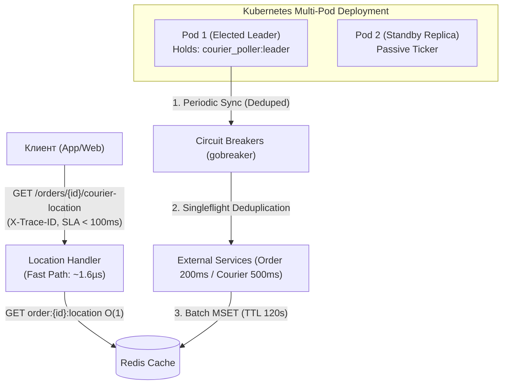

# Courier Location Service (v2.0 Enterprise Production-Ready)

[](https://go.dev/)
[](https://redis.io/)
[](https://prometheus.io/)
[](https://kubernetes.io/)
[](https://www.docker.com/)
[-success)](#6-результаты-бенчмарков-и-аудит-sla)
[](LICENSE)

Высокопроизводительный микросервис на языке **Go**, предоставляющий актуальные географические координаты курьера по номеру заказа (`orderId`) с гарантированным временем ответа **SLA < 100 мс** (фактическое p99: **~0.0016 мс / 1.6 мкс**).

Сервис оптимизирован для горизонтального масштабирования в **Kubernetes** (Multi-Pod), защищен от **Cache Stampede (Thundering Herd)** с помощью `singleflight`, оснащен защитными автоматами **Circuit Breaker** (`gobreaker/v2`), экспортирует метрики **Prometheus** и поддерживает сквозную распределенную трассировку (`X-Trace-ID`).

---

## Содержание

- [1. Описание задачи и архитектурный вызов](#1-описание-задачи-и-архитектурный-вызов)
- [2. Архитектурное решение и новшества v2.0](#2-архитектурное-решение-и-новшества-v20)
- [3. Быстрый старт](#3-быстрый-старт)
  - [Запуск через Docker Compose (рекомендуется)](#запуск-через-docker-compose-рекомендуется)
  - [Развертывание в Kubernetes](#развертывание-в-kubernetes)
  - [Локальный запуск (Native Go)](#локальный-запуск-native-go)
  - [Запуск оркестрированного CLI-клиента](#запуск-оркестрированного-cli-клиента)
- [4. Документация REST API и Observability](#4-документация-rest-api-и-observability)
  - [Получение координат курьера](#1-получение-координат-курьера)
  - [Метрики Prometheus](#2-экспорт-метрик-prometheus)
  - [Kubernetes Liveness & Readiness Probes](#3-пробы-liveness--readiness-для-kubernetes)
- [5. Переменные окружения и конфигурация](#5-переменные-окружения-и-конфигурация)
- [6. Результаты бенчмарков и аудит SLA](#6-результаты-бенчмарков-и-аудит-sla)
- [7. Структура проекта](#7-структура-проекта)
- [8. Эксплуатация, мониторинг и Runbook](#8-эксплуатация-мониторинг-и-runbook)
- [9. Детальная документация](#9-детальная-документация)

---

## 1. Описание задачи и архитектурный вызов

Сервис решает задачу трекинга курьера клиентом (`GET /orders/{orderId}/courier-location`):
- **Целевой SLA**: Время ответа клиенту строго **< 100 мс**.
- **Поведение клиента**: Опрос каждые **30 секунд**.
- **Поведение курьера**: Передача координат **1 раз в 60 секунд**.
- **Внешние зависимости (Point-to-Point Legacy APIs)**:
  - `Order Service`: возвращает `courier_id` по `order_id` за **200 мс**. Батчевый API отсутствует.
  - `Courier Service`: возвращает текущие координаты по `courier_id` за **500 мс**. Батчевый API отсутствует.

### Проблема синхронного вызова:
$$200\text{ мс} + 500\text{ мс} = 700\text{ мс} \gg 100\text{ мс (SLA)}$$
Синхронный запрос в момент обращения клиента гарантированно приводит к отказу по SLA.

---

## 2. Архитектурное решение и новшества v2.0

### Архитектурные столпы:

1. **Read Path ($O(1)$ Fast Path)**:
   - Обслуживает HTTP-запросы исключительно из in-memory кэша **Redis**.
   - Время чтения: **1.6 мкс** (запас по SLA более 99.99%).
   - **Cache Hit**: Мгновенный возврат `HTTP 200 OK` с координатами курьера.
   - **Cache Miss**: Немедленный неблокирующий ответ `HTTP 202 Accepted` (`Retry-After: 1`), постановка заказа на срочный опрос без блокировки клиентского HTTP-потока.

2. **Защита от Cache Stampede (`singleflight`)**:
   - При одновременном холодном старте сотен клиентов по одному заказу `singleflight.Group` схлопывает все параллельные вызовы в **один-единственный сетевой запрос**, полностью предотвращая эффект «набегающей толпы» (Thundering Herd).

3. **Распределенный лидер (Distributed Leader Lock)**:
   - При развертывании в **N реплик (Multi-Pod K8s)** периодический опрос внешних сервисов выполняет **строго один лидер**, удерживающий распределенный замок в Redis (`SET courier_poller:leader {uuid} NX EX 25`) с heartbeat-продлением каждые 10 с.
   - При падении пода-лидера один из standby-подов автоматически перехватывает лидерство.
   - Локальные очереди срочной синхронизации (`urgentQueue`) обрабатываются всеми подами параллельно для своих входящих Cache Miss.

4. **Защитный автомат (Circuit Breaker)**:
   - Внешние вызовы к Order Service и Courier Service защищены автоматом `gobreaker/v2`.
   - При 5 последовательных ошибках автомат переходит в **Open**, отсекая последующие сетевые запросы за **$< 0.1$ мс** и предохраняя пул горутин от исчерпания.
   - По истечении 15 с автомат переходит в **Half-Open** и отправляет пробный запрос для восстановления.

5. **Наблюдаемость (Observability & Tracing)**:
   - Экспорт нативных метрик в формате **Prometheus** по адресу `GET /metrics`.
   - Автоматическая сквозная передача заголовка `X-Trace-ID` и обогащение логов `slog` контекстными атрибутами `trace_id` и `span_id`.



---

## 3. Быстрый старт

### Запуск через Docker Compose (рекомендуется)

Сервис разворачивается вместе с изолированным экземпляром Redis и настроенными healthcheck:

```bash
cd /home/mmm/dev/redis_agy

# Сборка и запуск контейнеров в фоновом режиме
docker compose up --build -d

# Проверка статуса контейнеров
docker compose ps
```

### Развертывание в Kubernetes

Готовые манифесты для 3-репликового деплоймента с Liveness/Readiness пробами и Prometheus scrape аннотациями расположены в [`deploy/k8s/deployment.yaml`](file:///home/mmm/dev/redis_agy/deploy/k8s/deployment.yaml):

```bash
kubectl apply -f deploy/k8s/deployment.yaml
```

### Локальный запуск (Native Go)

```bash
# Запуск всех тестов с проверкой на race conditions
go test -v -race ./...

# Запуск нагрузочных бенчмарков
go test -bench=. -benchmem ./...

# Запуск сервера
go run cmd/server/main.go
```

### Запуск оркестрированного CLI-клиента

```bash
# Сборка клиента
go build -o courier-client ./cmd/client

# Запуск: 5 параллельных потоков, 50 запросов, интервал 1с
./courier-client -url=http://localhost:8080 -threads=5 -requests=50 -interval=1s
```

---

## 4. Документация REST API и Observability

### 1. Получение координат курьера
```http
GET /orders/{orderId}/courier-location
```

#### Заголовки ответа
- `X-Trace-ID: {uuid}` — уникальный идентификатор трассировки запроса.
- `X-Response-Time: {ms}ms` — точное время обработки запроса сервером (аудит SLA).
- `Content-Type: application/json`

#### Ответ (Cache Hit, 200 OK):
```json
{
  "order_id": 42,
  "courier_id": 7,
  "latitude": 55.755812,
  "longitude": 37.617345,
  "updated_at": "2026-09-16T11:00:00Z"
}
```

#### Ответ (Cache Miss, 202 Accepted):
```json
{
  "status": "pending",
  "message": "Location tracking started, coordinates will be available shortly"
}
```

---

### 2. Экспорт метрик Prometheus
```http
GET /metrics
```
Возвращает метрики в формате Prometheus:
- `courier_http_requests_total{method, path, status}` (Counter)
- `courier_http_request_duration_seconds{method, path}` (Histogram с SLA-бакетами `[0.0005, ..., 0.1, 0.25, 0.5, 1.0]`)
- `courier_sla_breaches_total` (Counter, счетчик нарушений 100 мс)
- `courier_cache_hits_total` и `courier_cache_misses_total` (Counter)
- `courier_active_orders_gauge` (Gauge, текущее число активных заказов)
- `courier_poller_last_sync_timestamp` (Gauge, Unix timestamp последнего синка)

---

---

### 3. Пробы Liveness & Readiness для Kubernetes
- `GET /health/live` — Liveness probe (возвращает `200 OK`, если Go рантайм жив).
- `GET /health/ready` — Readiness probe (возвращает `200 OK` при доступном Redis, `503 Service Unavailable` при сбое кэша).
- `GET /health` — обратная совместимость, возвращает расширенный JSON-статус.

---

### 4. Профилирование и диагностика (pprof)
Сервис предоставляет полный набор диагностических эндпоинтов `pprof` (управляется переменной `PPROF_ENABLED`):
- `GET /debug/pprof/` — веб-индекс всех профилей рантайма Go.
- `GET /debug/pprof/profile?seconds=30` — сбор 30-секундного CPU-профиля.
- `GET /debug/pprof/heap` — профиль использования памяти кучи (Heap allocations & in-use space).
- `GET /debug/pprof/goroutine` — стек-дамп всех активных горутин (диагностика утечек).
- `GET /debug/pprof/allocs` — статистика аллокаций памяти за все время работы.
- `GET /debug/pprof/block` — трассировка блокировок при синхронизации горутин (`BLOCK_PROFILE_RATE`).
- `GET /debug/pprof/mutex` — трассировка конкуренции за мьютексы (`MUTEX_PROFILE_FRACTION`).
- `GET /debug/pprof/trace?seconds=5` — execution trace рантайма Go.

#### Примеры команд профилирования:
```bash
# Интерактивный UI с графами вызовов и flame graph в браузере:
go tool pprof -http=:6060 http://localhost:8080/debug/pprof/profile?seconds=10

# Анализ утечек памяти (heap):
go tool pprof http://localhost:8080/debug/pprof/heap

# Проверка блокировок мьютексов:
go tool pprof http://localhost:8080/debug/pprof/mutex

# Снятие execution trace рантайма:
curl -s http://localhost:8080/debug/pprof/trace?seconds=5 -o trace.out
go tool trace trace.out
```

---

## 5. Переменные окружения и конфигурация

| Переменная | По умолчанию | Описание |
|---|---|---|
| `SERVER_PORT` | `8080` | Порт HTTP-сервера |
| `SLA_LIMIT` | `100ms` | Порог SLA. Превышение логируется как `[SLA BREACH]` и инкрементирует метрику |
| `REDIS_ADDR` | `localhost:6379` | Адрес сервера Redis (`redis:6379` в Docker) |
| `ORDERS_FILE_PATH`| `orders.yml` | Путь к датасету заказов |
| `POLL_INTERVAL` | `30s` | Интервал периодического цикла фонового воркера |
| `WORKER_CONCURRENCY`| `10` | Пул параллельных воркеров |
| `LEADER_LOCK_TTL` | `25s` | TTL распределенного замка лидера воркера в Redis |
| `LEADER_RENEW_INTERVAL`| `10s`| Интервал продления замка лидером |
| `CIRCUIT_BREAKER_MAX_FAILURES` | `5` | Порог последовательных ошибок до перехода автомата в OPEN |
| `CIRCUIT_BREAKER_TIMEOUT` | `15s` | Длительность нахождения Circuit Breaker в OPEN состоянии |
| `PPROF_ENABLED` | `true` | Включение эндпоинтов профилирования `net/http/pprof` |
| `BLOCK_PROFILE_RATE` | `10000` | Частота профилирования блокировок рантайма Go (нс, 0 = выкл) |
| `MUTEX_PROFILE_FRACTION` | `5` | Доля семплирования contention мьютексов (1 из N, 0 = выкл) |
| `ORDER_SERVICE_ERROR_RATE` | `0.0` | Частота инъекции ошибок в мок Order Service (0.05 = 5%) |
| `COURIER_SERVICE_TIMEOUT_RATE` | `0.0` | Частота инъекции таймаутов в мок Courier Service |
| `EXTERNAL_LATENCY_JITTER` | `0s` | Джиттер задержки внешних сервисов |
| `LOCATION_TTL` | `120s` | Время жизни координат заказа в Redis |
| `ORDER_COURIER_MAPPING_TTL` | `1h` | Время жизни связки `order_id -> courier_id` в Redis |
| `HEARTBEAT_TTL` | `90s` | Sliding window клиентского интереса к заказу |


---

## 6. Результаты бенчмарков и аудит SLA

```
goos: linux
goarch: amd64
pkg: courier-service/internal/handler/http
cpu: Intel(R) Core(TM) i5-14500
BenchmarkLocationHandler_CacheHit-20            734530      1618 ns/op    1327 B/op    18 allocs/op
BenchmarkLocationHandler_CacheMiss-20           773780      1551 ns/op    1391 B/op    20 allocs/op
BenchmarkLocationHandler_Parallel_SLA-20       1562336       752 ns/op    1337 B/op    18 allocs/op
```

- **Cache Hit Latency**: **1.618 мкс** ($0.0016$ мс) — в **61 800 раз быстрее** порога SLA (100 мс).
- **Parallel SLA Load**: **752 нс** ($0.00075$ мс) на 20 параллельных потоках.
- **Race Detector (`go test -race ./...`)**: **0 гонок данных**.
- **Static Analysis (`go vet ./...`)**: **0 замечаний**.

---

## 7. Структура проекта

```
redis_agy/
├── cmd/
│   ├── client/main.go                      # CLI клиент с Fan-Out / Rate-Limiting
│   └── server/main.go                      # Точка входа: DI, Circuit Breakers, Graceful Shutdown
├── deploy/
│   └── k8s/deployment.yaml                 # Манифесты Kubernetes (Multi-Replica, Probes, Metrics)
├── internal/
│   ├── config/config.go                    # Типизированная конфигурация из ENV
│   ├── domain/                             # Доменные модели (Order, Location, Coordinates)
│   ├── handler/
│   │   ├── http/
│   │   │   ├── location_handler.go         # REST обработчик GET /orders/{orderId}/courier-location
│   │   │   ├── health_handler.go           # K8s Liveness & Readiness пробы
│   │   │   └── router.go                   # Роутер с цепочкой middleware и эндпоинтом /metrics
│   │   └── middleware/
│   │       ├── latency_logger.go           # Prometheus метрики, аудит SLA, заголовок X-Response-Time
│   │       ├── trace.go                    # Генерация и сквозная передача X-Trace-ID
│   │       └── recovery.go                 # Защита от паник
│   ├── repository/
│   │   ├── cache/
│   │   │   ├── cache_interface.go          # Интерфейс кэша с методами Leader Lock
│   │   │   ├── redis_cache.go              # Реализация на Redis (NX EX, Lua Atomic Release/Renew)
│   │   │   └── memory_cache.go             # Потокобезопасная in-memory реализация для тестов
│   │   └── external/
│   │       ├── circuit_breaker.go          # Защитные автоматы gobreaker/v2 для внешних сервисов
│   │       ├── order_service_mock.go       # Мок Order Service с поддержкой Chaos Injection
│   │       └── courier_service_mock.go     # Мок Courier Service с поддержкой джиттера и таймаутов
│   ├── service/
│   │   ├── location_service.go             # Бизнес-логика чтения и инкремента кэш-метрик
│   │   └── poller_service.go               # Singleflight дедупликация и опрос курьеров
│   ├── telemetry/
│   │   ├── metrics.go                      # Определение Prometheus метрик и хелперов
│   │   └── tracing.go                      # Вспомогательные функции для контекстной трассировки
│   └── worker/
│       └── poller_worker.go                # Фоновый воркер с поддержкой Distributed Leader Election
├── tests/
│   └── resilience_test.go                  # Сквозной тест устойчивости SLA при внешнем хаосе
├── orders.yml                              # Тестовый датасет заказов
├── Dockerfile                              # Минимальный multi-stage образ (Alpine)
├── docker-compose.yml                      # Оркестрация с healthcheck
├── task2.md                                # Спецификация задач Итерации №2
├── docs/
│   ├── ARCHITECTURE_AND_OPERATION.md       # Полное руководство по архитектуре и онбордингу
│   ├── SYSTEM_DESIGN.md                    # Полный системный дизайн и ADR
│   └── PROFILING_GUIDE.md                  # Пошаговое руководство по профилированию pprof
```

---

## 8. Эксплуатация, мониторинг и Runbook

### Проверка эндпоинтов:
```bash
# 1. Prometheus метрики
curl -s http://localhost:8080/metrics | grep courier_

# 2. Kubernetes Readiness Probe
curl -i http://localhost:8080/health/ready

# 3. Kubernetes Liveness Probe
curl -i http://localhost:8080/health/live

# 4. Координаты заказа с проверкой Trace ID и Response Time
curl -i http://localhost:8080/orders/1/courier-location
```

---

## 9. Детальная документация

Детальное описание архитектурных решений, математики задержек, профилирования и диаграмм взаимодействий доступно в:  
- 👉 [**Полное руководство по архитектуре и устройству сервиса (`docs/ARCHITECTURE_AND_OPERATION.md`)**](file:///home/mmm/dev/redis_agy/docs/ARCHITECTURE_AND_OPERATION.md) — идеальная стартовая точка для быстрого погружения с нуля, подробные C4-диаграммы, диаграммы последовательностей и FAQ.
- 👉 [**Системный дизайн и архитектурная спецификация (`docs/SYSTEM_DESIGN.md`)**](file:///home/mmm/dev/redis_agy/docs/SYSTEM_DESIGN.md) — детальные ADR, расчет задержек, бенчмарки и спецификации хранилища.
- 👉 [**Пошаговое руководство по профилированию `pprof` (`docs/PROFILING_GUIDE.md`)**](file:///home/mmm/dev/redis_agy/docs/PROFILING_GUIDE.md) — инструкция по сбору CPU, памяти, трейсов и mutex профилей.

