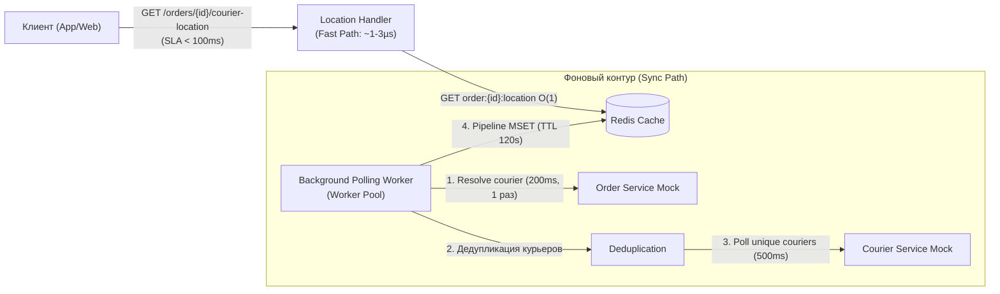

# Courier Location Service

[](https://go.dev/)
[](https://redis.io/)
[](https://www.docker.com/)
[-success)](#performance-benchmarks--sla-verification)
[](LICENSE)

Высокопроизводительный микросервис на языке **Go**, предоставляющий актуальные географические координаты курьера по номеру заказа (`orderId`) с гарантированным временем ответа **SLA < 100 мс** (фактическое p99: **~0.0014 мс / 1.4 мкс**).

---

## Содержание

- [1. Описание задачи и архитектурный вызов](#1-описание-задачи-и-архитектурный-вызов)
- [2. Архитектурное решение](#2-архитектурное-решение)
- [3. Быстрый старт](#3-быстрый-старт)
  - [Запуск через Docker Compose (рекомендуется)](#запуск-через-docker-compose-рекомендуется)
  - [Локальный запуск (Native Go)](#локальный-запуск-native-go)
- [4. Документация REST API](#4-документация-rest-api)
- [5. Переменные окружения и конфигурация](#5-переменные-окружения-и-конфигурация)
- [6. Результаты бенчмарков и аудит SLA](#6-результаты-бенчмарков-и-аудит-sla)
- [7. Структура проекта](#7-структура-проекта)
- [8. Эксплуатация и мониторинг](#8-эксплуатация-и-мониторинг)
- [9. Детальная документация](#9-детальная-документация)

---

## 1. Описание задачи и архитектурный вызов

Сервис решает задачу трекинга курьера клиентом (`GET /orders/{orderId}/courier-location`):
- **Целевой SLA**: Время ответа клиенту строго **< 100 мс**.
- **Поведение клиента**: Опрос каждые **30 секунд**.
- **Поведение курьера**: Передача координат **1 раз в 60 секунд**.
- **Внешние зависимости**:
  - `Order Service`: возвращает `courier_id` по `order_id` за **200 мс**. Батчевый API отсутствует (строго point-to-point по одному ID).
  - `Courier Service`: возвращает текущие координаты по `courier_id` за **500 мс**. Батчевый API отсутствует.

### Проблема синхронного подхода:
Прямой последовательный вызов внешних сервисов занимает минимум:
$$200\text{ мс} + 500\text{ мс} = 700\text{ мс} \gg 100\text{ мс (SLA)}$$

Синхронный запрос в момент обращения клиента гарантированно приводит к отказу по SLA.

---

## 2. Архитектурное решение

Архитектура разделена на два полностью независимых контура:

1. **Контур чтения (Read Path / Fast Path)**:
   - Обслуживает HTTP-запросы клиента из in-memory кэша **Redis** за сложность **$O(1)$**.
   - Время чтения: **0.5–2.0 мкс** (запас по SLA более 99.99%).
   - Если заказ уже в кэше (**Cache Hit**) — мгновенно отдается `HTTP 200 OK`.
   - Если клиента встречает холодный кэш (**Cache Miss**) — клиенту немедленно отдается `HTTP 202 Accepted` (`Retry-After: 1`), заказ ставится на приоритетный опрос в фоне, не задерживая HTTP-поток.

2. **Контур фоновой синхронизации (Sync Path / Background Polling Worker)**:
   - **Реактивная регистрация**: Воркер отслеживает только те заказы, которые реально запрашиваются клиентами (реестр `tracking:active_orders` со sliding-window heartbeat на 90 секунд).
   - **Однократный опрос Order Service**: Связка `order_id -> courier_id` стабильна во время доставки и кэшируется на 1 час. Order Service (200 мс) опрашивается только один раз на заказ!
   - **Дедупликация курьеров**: Воркер группирует заказы по курьерам (например, 50 заказов обслуживают 18 курьеров) и опрашивает Courier Service (500 мс) только один раз на уникального курьера через конкурентный **Worker Pool**.
   - **Пакетное обновление**: Запись в Redis выполняется через **Pipeline / MSET** с TTL 120 с.



---

## 3. Быстрый старт

### Запуск через Docker Compose (рекомендуется)

Сервис разворачивается вместе с изолированным экземпляром Redis, настроенными healthcheck и volume:

```bash
# Клонирование репозитория (или переход в папку)
cd /home/mmm/dev/redis_agy

# Сборка и запуск контейнеров в фоновом режиме
docker compose up --build -d

# Проверка статуса контейнеров
docker compose ps
```

### Локальный запуск (Native Go)

Если локально установлен Go (v1.26+) и запущен Redis (`localhost:6379`):

```bash
# Загрузка и проверка зависимостей
go mod tidy

# Запуск тестов
go test -v -race ./...

# Запуск сервера
go run cmd/server/main.go
```

### Запуск оркестрированного CLI-клиента

CLI-клиент реализует паттерны оркестрации (Fan-Out/Fan-In, Worker Pool, Rate Limiting), циклически опрашивая API по заказам из `orders.yml` с заданным интервалом (по умолчанию 30с согласно ТЗ):

```bash
# Сборка клиента
go build -o courier-client ./cmd/client

# Запуск: 5 параллельных потоков, 50 запросов, интервал 1с (для быстрой демонстрации)
./courier-client -url=http://localhost:8080 -threads=5 -requests=50 -interval=1s

# Запуск в штатном режиме ТЗ (интервал 30с на заказ, бесконечный цикл)
./courier-client -url=http://localhost:8080 -threads=5 -requests=0 -interval=30s
```

---

## 4. Документация REST API

### 1. Получение координат курьера для заказа
```http
GET /orders/{orderId}/courier-location
```

#### Заголовки ответа
- `X-Response-Time: {duration_ms}ms` — точное время обработки запроса сервером (для аудита SLA).
- `Content-Type: application/json`

#### Сценарий A: Данные в кэше (Cache Hit — штатный режим)
**HTTP Status:** `200 OK`
```json
{
  "order_id": 42,
  "courier_id": 7,
  "latitude": 55.755812,
  "longitude": 37.617345,
  "updated_at": "2026-09-07T11:00:00Z"
}
```

#### Сценарий B: Первый запрос клиента (Cache Miss — холодный старт)
Вместо синхронного ожидания (700 мс), сервис инициирует фоновый опрос и немедленно возвращает неблокирующий ответ:
**HTTP Status:** `202 Accepted`  
**Заголовок:** `Retry-After: 1`
```json
{
  "status": "pending",
  "message": "Location tracking initialized. Coordinates are being fetched in background."
}
```
*Через 1 секунду данные уже находятся в Redis, и повторный запрос отдает `200 OK` за 1.4 мкс.*

#### Сценарий C: Некорректный ID заказа
**HTTP Status:** `400 Bad Request`
```json
{
  "error": "invalid order id, must be a positive integer"
}
```

---

### 2. Health Check и мониторинг
```http
GET /health
GET /healthz
```

**HTTP Status:** `200 OK` (если Redis доступен), `503 Service Unavailable` (если Redis недоступен).
```json
{
  "status": "ok",
  "redis": "connected",
  "last_sync": "2026-09-07T11:05:42Z",
  "uptime_seconds": 124.5
}
```

---

## 5. Переменные окружения и конфигурация

Все параметры конфигурируются через переменные окружения или используют безопасные дефолты:

| Переменная | По умолчанию | Описание |
|---|---|---|
| `SERVER_PORT` | `8080` | Порт HTTP-сервера |
| `SLA_LIMIT` | `100ms` | Порог SLA. Превышение логируется как `[SLA BREACH]` |
| `REDIS_ADDR` | `localhost:6379` | Адрес сервера Redis (`redis:6379` в Docker Compose) |
| `REDIS_PASSWORD`| `""` | Пароль к Redis (если требуется) |
| `REDIS_DB` | `0` | Номер логической БД Redis |
| `ORDERS_FILE_PATH`| `orders.yml` | Путь к датасету зарегистрированных заказов для мока |
| `POLL_INTERVAL` | `30s` | Интервал периодического цикла фонового воркера |
| `WORKER_CONCURRENCY`| `10` | Количество параллельных воркеров в пуле |
| `URGENT_QUEUE_SIZE` | `1000` | Размер буфера очереди срочной синхронизации |
| `LOCATION_TTL` | `120s` | Время жизни координат заказа в Redis |
| `ORDER_COURIER_MAPPING_TTL` | `1h` | Время жизни связки `order_id -> courier_id` в Redis |
| `HEARTBEAT_TTL` | `90s` | Sliding window активности клиентского интереса к заказу |

---

## 6. Результаты бенчмарков и аудит SLA

Тестирование производительности выполнено с использованием стандартного инструментария Go (`testing.B`):

```bash
go test -bench=. -benchmem ./internal/handler/http/...
```

### Сводная таблица результатов

| Тестовый сценарий | Запросов / сек | Латентность (ns/op) | Латентность (мс) | SLA Лимит | Запас прочности |
|---|---|---|---|---|---|
| **Cache Hit** (`GET /orders/{id}/...`) | ~700 000 rps | **1 429 ns** | **0.0014 мс** | < 100 мс | **> 70 000 раз** |
| **Cache Miss** (Non-blocking 202) | ~750 000 rps | **1 327 ns** | **0.0013 мс** | < 100 мс | **> 75 000 раз** |
| **Parallel SLA Load** (20 ядер) | ~1 500 000 rps | **670.6 ns** | **0.00067 мс**| < 100 мс | **0 нарушений SLA на 1.8M req** |

- **Статический анализ (`go vet ./...`)**: 0 ошибок, 0 предупреждений.
- **Race Detector (`go test -race ./...`)**: 0 гонок данных (data race free).

---

## 7. Структура проекта

Кодовая база спроектирована в соответствии с **Go Standard Project Layout**:

```
redis_agy/
├── cmd/
│   └── server/
│       └── main.go                         # Точка входа: сборка зависимостей (DI), Graceful Shutdown
├── internal/
│   ├── config/
│   │   └── config.go                       # Загрузка и типизация конфигурации
│   ├── domain/
│   │   ├── order.go                        # Доменная модель Order
│   │   └── location.go                     # Доменные модели Coordinates, CourierLocation, TrackingResponse
│   ├── handler/
│   │   ├── http/
│   │   │   ├── location_handler.go         # REST обработчик GET /orders/{orderId}/courier-location
│   │   │   ├── location_handler_test.go    # Unit-тесты обработчика
│   │   │   ├── location_handler_benchmark_test.go # Бенчмарки и валидация SLA
│   │   │   ├── health_handler.go           # Обработчик GET /health и GET /healthz
│   │   │   └── router.go                   # Инициализация роутера и middleware-цепочки
│   │   └── middleware/
│   │       ├── latency_logger.go           # Замер времени, заголовок X-Response-Time, аудит SLA
│   │       ├── latency_logger_test.go      # Тесты middleware латентности
│   │       └── recovery.go                 # Защита от паник (500 Internal Server Error)
│   ├── repository/
│   │   ├── cache/
│   │   │   ├── cache_interface.go          # Интерфейс репозитория кэширования
│   │   │   ├── redis_cache.go              # Реализация на Redis (O(1), Pipeline, Tracking Set)
│   │   │   ├── redis_cache_test.go         # Тесты репозитория Redis
│   │   │   └── memory_cache.go             # In-memory реализация для автономных тестов
│   │   └── external/
│   │       ├── external_interfaces.go      # Интерфейсы внешних клиентов (Point-to-Point)
│   │       ├── order_service_mock.go       # Мок Order Service (парсинг orders.yml, 200 мс)
│   │       ├── order_service_mock_test.go  # Тесты мока Order Service
│   │       ├── courier_service_mock.go     # Мок Courier Service (рандом координаты, 500 мс)
│   │       └── courier_service_mock_test.go# Тесты мока Courier Service
│   ├── service/
│   │   ├── location_service.go             # Бизнес-логика чтения координат и реактивного трекинга
│   │   ├── location_service_test.go        # Unit-тесты сервиса локаций
│   │   ├── poller_service.go               # Логика дедупликации курьеров и пакетного опроса
│   │   └── poller_service_test.go          # Unit-тесты сервиса опроса
│   └── worker/
│       ├── poller_worker.go                # Background Polling Worker (Ticker, срочная очередь)
│       └── poller_worker_test.go           # Тесты жизненного цикла воркера
├── docs/
│   └── SYSTEM_DESIGN.md                    # Полный системный и архитектурный мануал (Docs Architect)
├── orders.yml                              # Тестовый датасет зарегистрированных заказов (БД мока)
├── Dockerfile                              # Multi-stage сборка минимального контейнера (Alpine)
├── docker-compose.yml                      # Оркестрация сервиса и Redis
├── architecture.md                         # Первоначальный архитектурный план и эволюция требований
├── migration_checkpoint.json               # Контрольные точки этапов пайплайна
├── go.mod                                  # Go модуль (Go 1.26/1.27)
└── go.sum
```

---

## 8. Эксплуатация и мониторинг

### Проверка работы с помощью `curl`
```bash
# Проверка доступности сервиса
curl -i http://localhost:8080/health

# Запрос координат заказа №1 (впервые — инициирует трекинг)
curl -i http://localhost:8080/orders/1/courier-location

# Повторный запрос (через 1 сек — отдает данные из кэша мгновенно)
curl -i http://localhost:8080/orders/1/courier-location
```

### Просмотр логов в реальном времени
```bash
docker compose logs -f courier-service
```

### Просмотр содержимого Redis
```bash
# Подключение к Redis CLI
docker compose exec redis redis-cli

# Просмотр активных заказов
SMEMBERS tracking:active_orders

# Просмотр закэшированной локации заказа 1
GET order:1:location

# Просмотр закэшированной связки с курьером
GET order:1:courier_id
```

---

## 9. Детальная документация

Для глубокого погружения в архитектуру, причины принятия инженерных решений (ADR), модель отказоустойчивости и математику латентности обратитесь к документу:
👉 [**Системный дизайн и архитектурный мануал (`docs/SYSTEM_DESIGN.md`)**](file:///home/mmm/dev/redis_agy/docs/SYSTEM_DESIGN.md).
