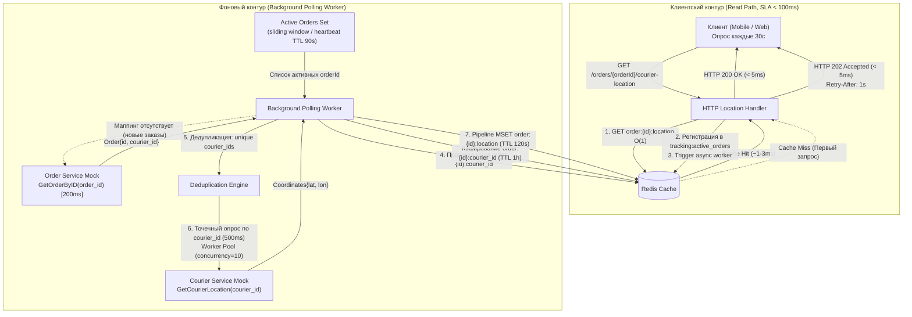
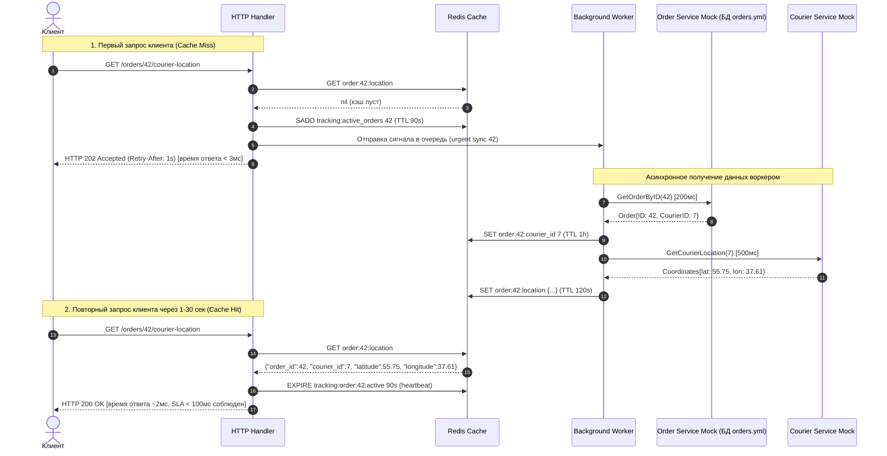

# Архитектура сервиса Courier Location Service

## 1. Анализ предметной области и системных ограничений

### 1.1. Входные требования и SLA
- **Назначение сервиса**: Предоставление актуальных геокоординат курьера по идентификатору заказа (`orderId`) через REST API.
- **Эндпоинт**: `GET /orders/{orderId}/courier-location`
- **Целевой SLA**: Время ответа API **< 100 мс** (p99).
- **Частота обращений клиента**: Каждые 30 секунд на один заказ.
- **Частота обновления координат курьером**: 1 раз в 60 секунд.
- **Технологический стек**: Go (Golang) v1.26, Redis как in-memory кэш-хранилище.

### 1.2. Ограничения внешних сервисов и доступности данных
1. **Распределение знаний об идентификаторах заказов (`orderId`)**:
   - Идентификаторы заказов **известны только клиенту и самому Order Service**.
   - Наш сервис (Courier Location Service) и фоновый воркер **не имеют и не могут иметь априорного знания о списке заказов при запуске**.
   - Нет ни общего реестра заказов в Courier Location Service, ни батчевого API для их получения.
2. **Order Service**:
   - Задача: Определение `courier_id` по переданному `order_id`.
   - **Ограничение API**: Сервис **НЕ имеет батчевого API**. Доступен **только точечный запрос по ID одного заказа**: `GetOrderByID(order_id)`.
   - Задержка ответа: **200 мс** на каждый точечный вызов.
   - **Роль `orders.yml`**: это статический **тестовый датасет**, эмулирующий внутреннюю базу данных самого Order Service для мок-структуры. Сервис Courier Location Service напрямую в бизнес-логике его не читает.
3. **Courier Service**:
   - Задача: Получение актуальных координат `(latitude, longitude)` по `courier_id`.
   - **Ограничение API**: Сервис **НЕ имеет батчевого API**. Доступен **только точечный запрос по ID одного курьера**: `GetCourierLocation(courier_id)`.
   - Задержка ответа: **500 мс** на каждый точечный вызов.
   - Поведение эмуляции: генерация псевдослучайных координат.

### 1.3. Анализ проблемы синхронного подхода (Bottleneck Analysis)
Если обрабатывать запрос клиента синхронно в момент вызова эндпоинта:
$$T_{total} = T_{OrderService}(orderId) + T_{CourierService}(courierId) + T_{internal} \ge 200\text{ мс} + 500\text{ мс} = 700\text{ мс}$$

$700\text{ мс} \gg 100\text{ мс}$ (превышение допустимого SLA в 7 раз).

Даже одиночный вызов `Order Service` (200 мс) или `Courier Service` (500 мс) в синхронном потоке клиента **гарантированно нарушает SLA 100 мс**.
Следовательно, обработчик клиентских запросов **ни при каких условиях не должен выполнять синхронных блокирующих вызовов к внешним сервисам**.

---

## 2. Архитектурное решение: Реактивная регистрация и On-Demand Polling

Поскольку `orderId` становится известен сервису **только в момент первого обращения клиента**, применяется модель **реактивной подписки на отслеживание (Reactive On-Demand Tracking)** с разделением на Read Path и Sync Path.



### 2.1. Контур чтения (Read Path)
1. Клиент выполняет запрос `GET /orders/{orderId}/courier-location`.
2. Хэндлер проверяет наличие данных в Redis по ключу `order:{orderId}:location`.
3. **Сценарий 1: Cache Hit (Повторные запросы клиента каждые 30 секунд)**:
   - Данные найдены в Redis ($O(1)$, время чтения ~0.5–2 мс).
   - Хэндлер обновляет heartbeat активности заказа (продлевает TTL в множестве `tracking:active_orders`).
   - Возвращается ответ `HTTP 200 OK` с актуальными координатами.
   - **Итоговое время ответа: 1–5 мс** (полное соответствие SLA < 100 мс).
4. **Сценарий 2: Cache Miss (Первый запрос клиента для данного `orderId`)**:
   - Так как синхронный запрос к внешним сервисам занял бы $\ge 700$ мс (грубое нарушение SLA), хэндлер:
     1. Добавляет `orderId` в реестр отслеживаемых заказов `tracking:active_orders` с TTL (например, 90 секунд).
     2. Инициирует внеочередную задачу синхронизации для данного `orderId` через внутренний Go-канал `syncQueue`.
     3. Немедленно (за 1–3 мс) возвращает ответ:
        - `HTTP 202 Accepted` (или `HTTP 404 Not Found` с кодом `LOCATION_BEING_RESOLVED`).
        - Заголовок `Retry-After: 1`.
        - Тело ответа: `{"status": "pending", "message": "Location tracking started, coordinates will be available shortly"}`.
   - За следующие 700–900 мс фоновый воркер опрашивает `Order Service` и `Courier Service` и сохраняет координаты в Redis.
   - При повторном обращении клиента (через 1–2 с или по стандартному интервалу 30 с) запрос попадает в сценарий **Cache Hit** и отдается за ~2 мс.

### 2.2. Контур синхронизации (Sync Path: Background Polling Worker)

1. **Динамический реестр активных заказов (Active Tracking Registry)**:
   - Воркер отслеживает **только те заказы, которые реально запрашиваются клиентами**.
   - Реестр хранится в Redis (множество `tracking:active_orders` или ключи `tracking:order:{id}:active` с TTL 90–120 секунд).
   - Каждый входящий клиентский запрос выступает в роли "heartbeat" и обновляет TTL.
   - Если клиент закрыл экран/приложение и перестал запрашивать координаты (прошло > 90 с), заказ автоматически удаляется по TTL, и воркер прекращает его опрос, не расходуя ресурсы.

2. **Опрос Order Service (строго по одному ID, 200 мс) — однократно**:
   - Связка `order_id -> courier_id` стабильна на всем протяжении доставки.
   - Воркер проверяет в Redis наличие ключа `order:{orderId}:courier_id`.
   - Если связка уже есть в кэше, обращение к Order Service **пропускается**.
   - Если связки нет (новый заказ), воркер вызывает `OrderService.GetOrderByID(orderId)` (200 мс) и сохраняет результат в кэш с длительным TTL (например, 1 час).
   - Таким образом, Order Service опрашивается **только 1 раз при регистрации заказа**, а не на каждом цикле обновления координат!

3. **Дедупликация курьеров**:
   - Из всех активных заказов воркер извлекает множество уникальных `courier_id`.
   - Если несколько активных заказов обслуживает один и тот же курьер, опрос Courier Service для этого курьера происходит строго один раз.

4. **Опрос Courier Service (строго по одному ID, 500 мс)**:
   - С периодичностью раз в 30–60 секунд воркер конкурентно опрашивает `CourierService.GetCourierLocation(courier_id)` для всех уникальных активных курьеров через Worker Pool (например, `concurrency = 10`).

5. **Пакетное обновление координат в Redis**:
   - Полученные координаты курьеров записываются во все связанные активные заказы: `order:{orderId}:location` с TTL 120 секунд.



---

## 3. Схема хранения данных в Redis

| Ключ Redis | Тип | TTL | Назначение |
|---|---|---|---|
| `order:{order_id}:location` | `String` (JSON) | 120 с | Актуальные координаты курьера для заказа. Чтение за $O(1)$ на Read Path. |
| `order:{order_id}:courier_id` | `String` (int) | 3600 с (1 ч) | Кэш связки заказа и курьера. Позволяет опрашивать Order Service только 1 раз при появлении заказа. |
| `tracking:active_orders` | `Set` (int) | — | Реестр ID заказов, которые сейчас запрашиваются клиентами. |
| `tracking:order:{order_id}:heartbeat` | `String` | 90 с | Метка живости интереса клиента. При истечении заказ исключается из опроса. |
| `courier_poller:last_sync` | `String` | — | Временная метка последнего успешного цикла воркера для Health Check. |

---

## 4. Структура проекта (Go Standard Project Layout)

```
redis_agy/
├── cmd/
│   └── server/
│       └── main.go                     # Точка входа: DI, инициализация сервера и воркера, graceful shutdown
├── internal/
│   ├── config/
│   │   └── config.go                   # Конфигурация (Redis host, Worker concurrency, timeouts, intervals)
│   ├── domain/
│   │   ├── order.go                    # Доменные сущности: Order, Courier
│   │   └── location.go                 # Доменные сущности: CourierLocation, Coordinates, TrackingStatus
│   ├── handler/
│   │   ├── http/
│   │   │   ├── location_handler.go     # HTTP обработчик GET /orders/{orderId}/courier-location
│   │   │   ├── health_handler.go       # Health check & SLA метрики
│   │   │   └── router.go               # Маршруты и подключение middleware
│   │   └── middleware/
│   │       ├── latency_logger.go       # Замер латентности и аудит соблюдения SLA (< 100ms)
│   │       └── recovery.go             # Защита от паник
│   ├── service/
│   │   ├── location_service.go         # Бизнес-логика чтения координат и регистрации отслеживания
│   │   └── interfaces.go               # Интерфейсы доменных сервисов
│   ├── worker/
│   │   ├── poller_worker.go            # Background Polling Worker (периодический и срочный опрос)
│   │   └── pool.go                     # Worker Pool с лимитом параллелизма (Semaphore)
│   └── repository/
│       ├── cache/
│       │   ├── redis_cache.go          # Реализация кэша Redis (O(1), Pipeline, Tracking Set, Heartbeats)
│       │   └── cache_interface.go      # Абстракция хранилища кэша
│       └── external/
│           ├── order_service_mock.go   # Мок Order Service: strictly GetOrderByID(id), 200ms, БД из orders.yml
│           ├── courier_service_mock.go # Мок Courier Service: strictly GetCourierLocation(id), 500ms
│           └── external_interfaces.go  # Интерфейсы внешних клиентов (только single-item API)
├── pkg/
│   └── logger/
│       └── logger.go                   # Структурированный логгер (slog)
├── orders.yml                          # Тестовый датасет зарегистрированных заказов (БД мока Order Service)
├── docker-compose.yml                  # Запуск Redis + Service
├── go.mod                              # Go модуль (Go 1.26)
├── go.sum
├── task.md                             # Техническое задание
├── architecture.md                     # Архитектурный документ
└── migration_checkpoint.json           # Файл состояния контрольных точек
```

---

## 5. Компоненты и интерфейсы

### 5.1. Доменный слой (`internal/domain`)
```go
type Order struct {
    ID        int64 `json:"id" yaml:"id"`
    CourierID int64 `json:"courier_id" yaml:"courier_id"`
}

type Coordinates struct {
    Latitude  float64 `json:"latitude"`
    Longitude float64 `json:"longitude"`
}

type CourierLocation struct {
    OrderID   int64     `json:"order_id"`
    CourierID int64     `json:"courier_id"`
    Latitude  float64   `json:"latitude"`
    Longitude float64   `json:"longitude"`
    UpdatedAt time.Time `json:"updated_at"`
}
```

### 5.2. Слой интерфейсов внешних сервисов (`internal/repository/external`)
```go
// OrderServiceClient опрашивает Order Service строго точечно по одному ID заказа.
// Задержка ответа: 200 мс.
type OrderServiceClient interface {
    GetOrderByID(ctx context.Context, orderID int64) (*domain.Order, error)
}

// CourierServiceClient опрашивает Courier Service строго точечно по одному ID курьера.
// Задержка ответа: 500 мс.
type CourierServiceClient interface {
    GetCourierLocation(ctx context.Context, courierID int64) (*domain.Coordinates, error)
}
```

### 5.3. Слой кэширования (`internal/repository/cache`)
```go
type LocationCacheRepository interface {
    // Read Path: моментальное чтение O(1)
    GetOrderLocation(ctx context.Context, orderID int64) (*domain.CourierLocation, error)
    SetOrderLocationsBatch(ctx context.Context, locations []domain.CourierLocation, ttl time.Duration) error
    
    // Кэш маппинга order -> courier (позволяет вызывать Order Service только 1 раз на заказ)
    GetOrderCourierMapping(ctx context.Context, orderID int64) (int64, error)
    SetOrderCourierMapping(ctx context.Context, orderID int64, courierID int64, ttl time.Duration) error
    
    // Реактивное отслеживание активных заказов
    RegisterActiveOrder(ctx context.Context, orderID int64, heartbeatTTL time.Duration) error
    GetActiveOrderIDs(ctx context.Context) ([]int64, error)
    RefreshOrderHeartbeat(ctx context.Context, orderID int64, heartbeatTTL time.Duration) error
    RemoveInactiveOrders(ctx context.Context) error
}
```

### 5.4. Слой бизнес-логики (`internal/service` и `internal/worker`)
```go
type LocationService interface {
    // Возвращает локацию из кэша. При Cache Miss регистрирует заказ в трекинге и запускает асинхронный опрос
    GetCourierLocation(ctx context.Context, orderID int64) (*domain.CourierLocation, bool, error)
}
```

---

## 6. Механизм контроля SLA и отказоустойчивость

1. **Гарантия соблюдения SLA < 100 мс**:
   - При Cache Hit: чтение из Redis занимает **1–3 мс**.
   - При Cache Miss: регистрация в Redis и возврат HTTP 202 занимает **1–3 мс**.
   - Никаких блокирующих ожиданий внешних сервисов (200 мс и 500 мс) в HTTP-хэндлере.
   - Хэндлер гарантированно завершается за $< 10$ мс при любых обстоятельствах.

2. **SLA Monitoring Middleware**:
   - Замеряет `time.Since(start)` для каждого HTTP-запроса.
   - Добавляет HTTP-заголовок `X-Response-Time: {duration_ms}ms`.
   - Логирует предупреждение при превышении порога SLA (100 мс).

3. **Самоочистка неактивных заказов**:
   - Если клиент перестал слать запросы, заказ по истечении 90 секунд исключается из фонового опроса. Это защищает систему от деградации при росте общего числа исторических заказов.

4. **Graceful Shutdown**:
   - Корректная остановка HTTP-сервера.
   - Ожидание завершения текущей итерации воркера через `sync.WaitGroup` и отмену `context.Context`.

---

## 7. План последующих итераций реализации

| Номер итерации | Название | Содержание работ |
|---|---|---|
| **Итерация №1** (текущая) | Архитектурный анализ | Исследование ограничений (On-Demand регистрация, отсутствие списка заказов у воркера, single-item API), проектирование реактивного воркера, структура проекта, `architecture.md`. |
| **Итерация №2** | Моки и тестовый датасет | Реализация мока `OrderServiceMock` (только `GetOrderByID`, 200мс, данные из `orders.yml` как внутренней БД мока) и `CourierServiceMock` (только `GetCourierLocation`, 500мс). Модели домена. |
| **Итерация №3** | Кэш-слой Redis | Подключение к Redis, реализация `LocationCacheRepository` ($O(1)$ чтение, кэш связок `order->courier`, реестр `active_orders` с heartbeats). |
| **Итерация №4** | Background Polling Worker | Реализация воркера с динамическим опросом активных заказов, однократным получением `courier_id`, дедупликацией курьеров и очередью срочных задач. |
| **Итерация №5** | REST API и SLA Middleware | Реализация HTTP хэндлера `GET /orders/{orderId}/courier-location` (сценарии Hit/Miss), замер и аудит SLA (<100мс). |
| **Итерация №6** | Docker, E2E и Benchmarks | `docker-compose.yml`, интеграционные тесты, эмуляция клиентов, бенчмарки времени ответа под нагрузкой на соответствие SLA < 100мс. |
