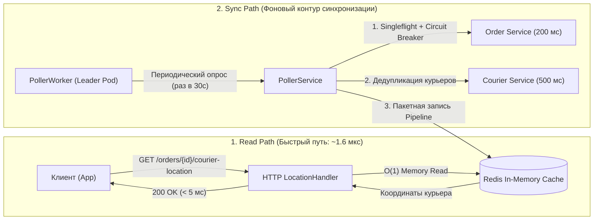
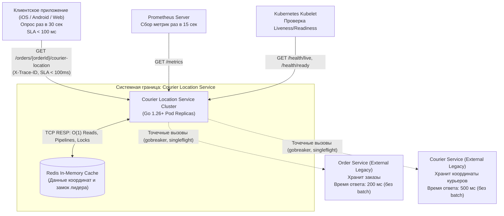
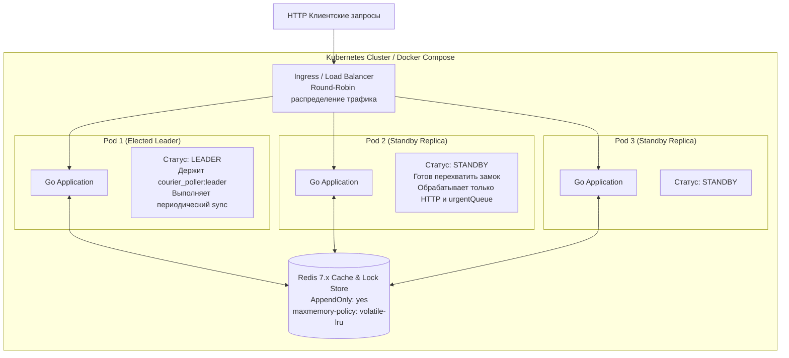
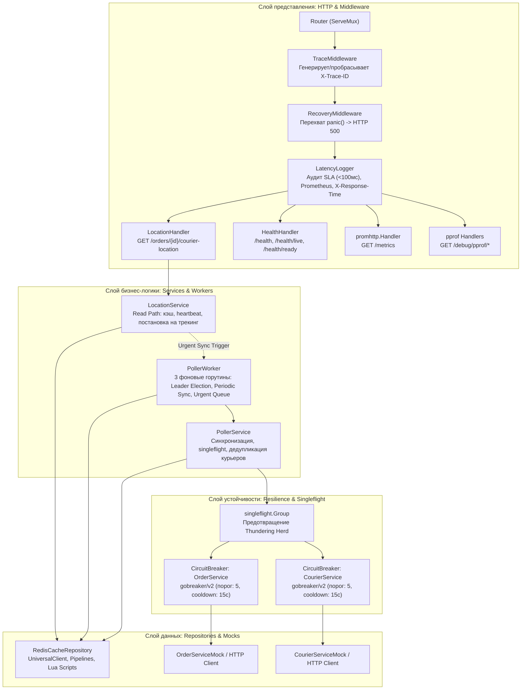
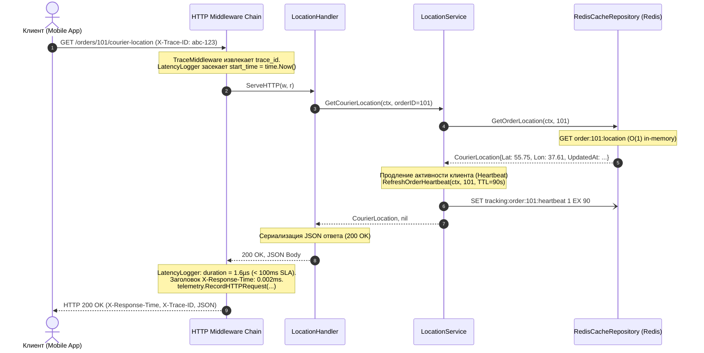
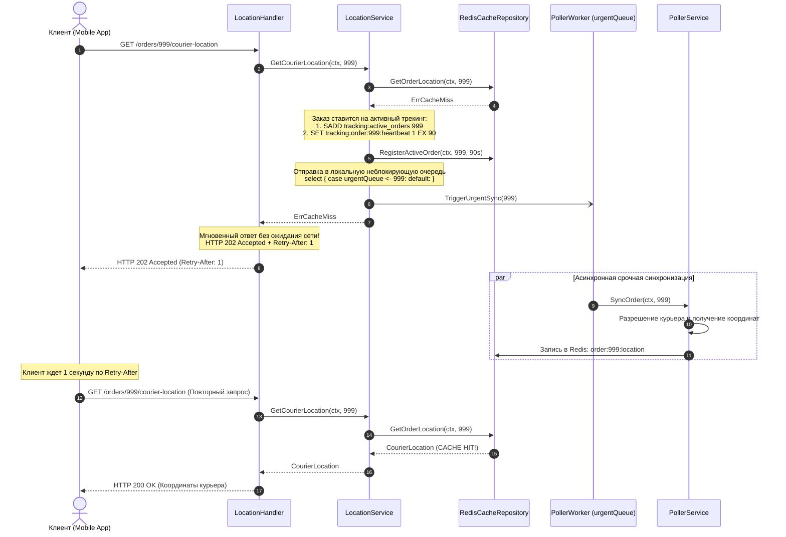
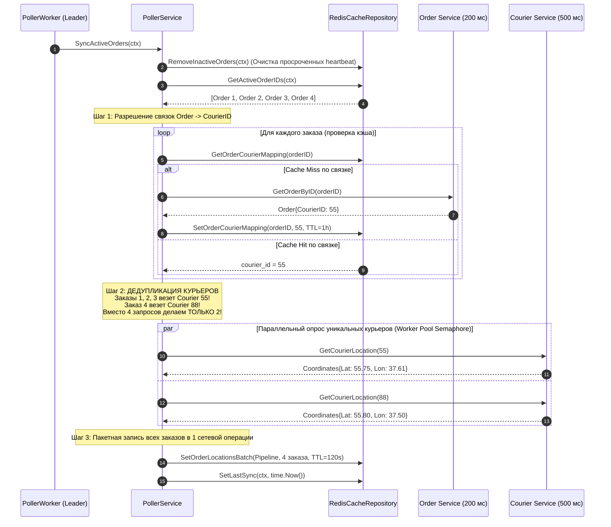
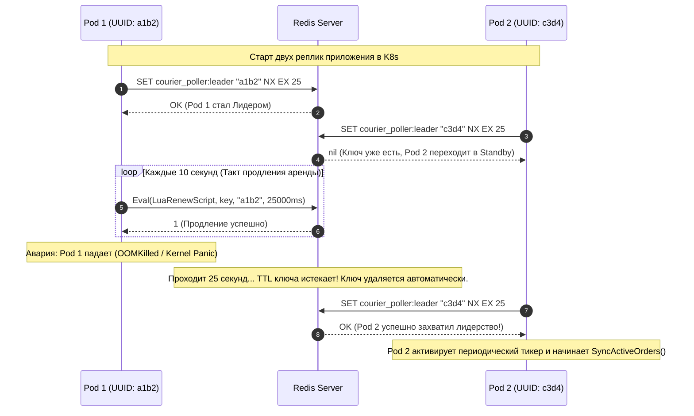
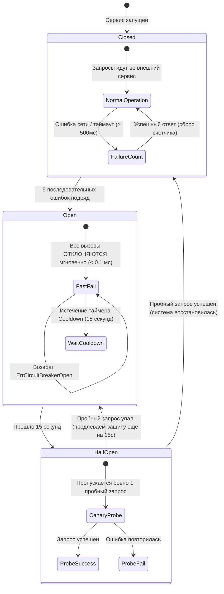
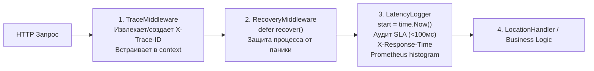

# Courier Location Service — Полное руководство по архитектуре и устройству сервиса

> **Документ:** Подробная техническая и архитектурная документация для быстрого онбординга и глубокого понимания проекта с нуля  
> **Версия:** 2.0 (Enterprise Production-Ready)  
> **Стек:** Go 1.26+, Redis 7.x, Kubernetes Multi-Pod, Prometheus, pprof, Docker

---

## Оглавление

1. [Введение и бизнес-контекст](#1-введение-и-бизнес-контекст)
   - [Какую задачу решает сервис](#какую-задачу-решает-сервис)
   - [Главная инженерная дилемма: почему "в лоб" не работает](#главная-инженерная-дилемма-почему-в-лоб-не-работает)
2. [Концептуальная идея архитектуры](#2-концептуальная-идея-архитектуры)
   - [Разделение путей: Read Path (Fast) vs. Sync Path (Background)](#разделение-путей-read-path-fast-vs-sync-path-background)
   - [Жизненный цикл заказа и статус кэша (Уточнение ADR-002)](#жизненный-цикл-заказа-и-статус-кэша-уточнение-adr-002)
3. [Детальная архитектура компонентов (C4 и схемы)](#3-детальная-архитектура-компонентов-c4-и-схемы)
   - [C4 Level 1: Системный контекст](#c4-level-1-системный-контекст)
   - [C4 Level 2: Контейнеры и окружение](#c4-level-2-контейнеры-и-окружение)
   - [C4 Level 3: Компоненты приложения и зависимости](#c4-level-3-компоненты-приложения-и-зависимости)
4. [Потоки данных и сценарии взаимодействия (Sequence Diagrams)](#4-потоки-данных-и-сценарии-взаимодействия-sequence-diagrams)
   - [Сценарий 1: Запрос клиента (Cache Hit — основной штатный режим)](#сценарий-1-запрос-клиента-cache-hit--основной-штатный-режим)
   - [Сценарий 2: Запрос клиента при холодном старте (Cache Miss & Reactive Fallback)](#сценарий-2-запрос-клиента-при-холодном-старте-cache-miss--reactive-fallback)
   - [Сценарий 3: Фоновая синхронизация и дедупликация курьеров](#сценарий-3-фоновая-синхронизация-и-дедупликация-курьеров)
   - [Сценарий 4: Выборы лидера в многоподовой среде (Distributed Leader Lock)](#сценарий-4-выборы-лидера-в-многоподовой-среде-distributed-leader-lock)
   - [Сценарий 5: Защита внешних вызовов (Circuit Breaker & Singleflight)](#сценарий-5-защита-внешних-вызовов-circuit-breaker--singleflight)
5. [Схема данных и хранение в Redis](#5-схема-данных-и-хранение-в-redis)
   - [Ключи, типы данных и TTL](#ключи-типы-данных-и-ttl)
   - [Heartbeat и автоматическая очистка неактивных заказов](#heartbeat-и-автоматическая-очистка-неактивных-заказов)
   - [Атомарные операции и Lua-скрипты](#атомарные-операции-и-lua-скрипты)
6. [Структура кода проекта и ответственность пакетов](#6-структура-кода-проекта-и-ответственность-пакетов)
   - [Карта файлов и назначение модулей](#карта-файлов-и-назначение-модулей)
   - [Цепочка HTTP Middleware](#цепочка-http-middleware)
7. [Наблюдаемость, диагностика и мониторинг (Observability)](#7-наблюдаемость-диагностика-и-мониторинг-observability)
   - [Трассировка X-Trace-ID и логи slog](#трассировка-x-trace-id-и-логи-slog)
   - [Метрики Prometheus](#метрики-prometheus)
   - [Пробы Kubernetes: Liveness и Readiness](#пробы-kubernetes-liveness-и-readiness)
   - [Профилирование pprof](#профилирование-pprof)
8. [Конфигурация и переменные окружения](#8-конфигурация-и-переменные-окружения)
9. [Руководство по локальной разработке, запуску и тестированию](#9-руководство-по-локальной-разработке-запуску-и-тестированию)
   - [Запуск с помощью Docker Compose](#запуск-с-помощью-docker-compose)
   - [Локальный запуск без контейнеров](#локальный-запуск-без-контейнеров)
   - [Генерация нагрузки через CLI-клиент](#генерация-нагрузки-через-cli-клиент)
   - [Запуск тестов и проверка гонок памяти](#запуск-тестов-и-проверка-гонок-памяти)
10. [FAQ и частые вопросы нового инженера](#10-faq-и-частые-вопросы-нового-инженера)

---

## 1. Введение и бизнес-контекст

### Какую задачу решает сервис

В современных системах доставки (еда, e-commerce, экспресс-доставка) пользователь мобильного или веб-приложения хочет в реальном времени видеть, где находится курьер, везущий его заказ.

Микросервис **Courier Location Service** предоставляет единственный ключевой бизнес-эндпоинт:
```http
GET /orders/{orderId}/courier-location
```
Ответ возвращает точные географические координаты курьера (`latitude`, `longitude`) и временную метку фиксации координат.

### Главная инженерная дилемма: почему "в лоб" не работает

В реальной production-системе существуют жесткие физические и инфраструктурные ограничения:

1. **Клиентский SLA**: по техническому заданию время ответа клиентского API должно быть строго **меньше 100 мс** (p99).
2. **Паттерн клиента**: мобильное приложение пользователя опрашивает сервер каждые **30 секунд**, пока открыт экран отслеживания.
3. **Паттерн курьера**: приложение курьера передает координаты на базовый сервер не чаще **1 раза в 60 секунд** (для экономии батареи и трафика).
4. **Унаследованные внешние микросервисы (Legacy APIs)**:
   - **Order Service**: хранит информацию о заказах и возвращает назначенный `courier_id` по номеру заказа `order_id`. Время ответа — **200 мс**.
   - **Courier Service**: хранит актуальные координаты курьеров и возвращает их по `courier_id`. Время ответа — **500 мс**.
   - **Критическое ограничение**: оба внешних сервиса работают **строго точечно** (Point-to-Point) — у них **нет пакетного API (batch)**, и менять их код запрещено.

#### Что происходит при синхронной реализации ("в лоб"):
```
Клиентский запрос 
  -> Order Service (200 мс) 
  -> Courier Service (500 мс) 
  = Суммарно: 700 мс сетевого ожидания
```
$$T_{\text{sync}} \ge 700\text{ мс} \gg 100\text{ мс (лимит SLA)}$$

Синхронный вызов нарушает SLA в **7 раз**, а при высокой нагрузке приводит к лавинообразному исчерпанию пула горутин/соединений и отказу сервиса (Cascading Failure).

---

## 2. Концептуальная идея архитектуры

### Разделение путей: Read Path (Fast) vs. Sync Path (Background)

Сервис построен по архитектурному паттерну **CQRS (Command Query Responsibility Segregation)**, разделяя обслуживание пользовательских запросов и синхронизацию с внешними источниками на два абсолютно независимых контура:



1. **Read Path (Контур чтения)**:
   - В момент поступления HTTP-запроса сервис **никогда не делает синхронных сетевых вызовов во внешние системы**.
   - Чтение происходит за $O(1)$ исключительно из распределенного кэша **Redis**.
   - Время ответа составляет в среднем **1.6 микросекунды (0.0016 мс)**, что обеспечивает запас по SLA более **99.99%**.

2. **Sync Path (Контур синхронизации)**:
   - Фоновый воркер `PollerWorker` периодически опрашивает внешние сервисы в фоне, пакетирует результаты и обновляет Redis.
   - Пользователь всегда получает свежие координаты из кэша без задержек.

### Жизненный цикл заказа и статус кэша (Уточнение ADR-002)

Важный архитектурный аспект касается того, **откуда берутся заказы и почему кэш не должен быть пустым**:

> [!IMPORTANT]
> **Принцип известности заказов (Known Orders)**:
> Список активных заказов известен не только клиенту, но и серверу. В реальной enterprise-архитектуре при создании заказа клиентом бэкенд уже знает об этом заказе (через события создания заказа, Kafka/RabbitMQ или базу данных). 
> 
> Следовательно, кэш должен быть инициализирован данными заказа **еще до того, как клиент откроет экран трекинга** и сделает свой первый запрос `GET /orders/{orderId}/courier-location`. Ситуация, когда клиент попадает в "холодный кэш" (Cache Miss) для существующего заказа, должна быть сведена к нулю.

#### В проекте реализованы две модели:

1. **Production-модель (Целевая)**:
   - При создании заказа в системе публикуется событие или вызывается инициализация кэша. Заказ автоматически ставится на мониторинг, и координаты курьера загружаются заранее.
   - Клиент с первого же запроса гарантированно попадает в **Cache Hit (200 OK)**.

2. **Тестовая модель с моками (Pre-Warm на старте)**:
   - Для эмуляции базы данных существующих заказов в проекте используется файл `orders.yml`.
   - При старте сервиса выполняется процедура **Pre-Warm Cache**: первый запустившийся под считывает все заказы из `orders.yml`, регистрирует их в Redis (`tracking:active_orders`), кэширует связки `order -> courier_id` и пакетно предзагружает координаты курьеров.
   - **Multi-Pod координация**: Чтобы поды не дублировали предзагрузку при одновременном старте в Kubernetes, используется флаг `courier_poller:prewarmed` в Redis (`IsPreWarmed` / `SetPreWarmed`).

3. **Реактивный Fallback (Reactive On-Demand)**:
   - Если по какой-то непредвиденной причине поступил запрос по заказу, которого еще нет в кэше (например, задержка репликации или совершенно новый заказ), срабатывает реактивный механизм:
     - Сервис **не блокирует** клиента на 700 мс.
     - Клиенту возвращается неблокирующий ответ `HTTP 202 Accepted` с заголовком `Retry-After: 1`.
     - Заказ немедленно ставится в очередь срочной фоновой синхронизации `urgentQueue`.
     - Через 1 секунду клиент повторяет запрос и получает `HTTP 200 OK` из уже прогретого кэша.

---

## 3. Детальная архитектура компонентов (C4 и схемы)

### C4 Level 1: Системный контекст

Диаграмма показывает место Courier Location Service в общей экосистеме предприятия:



### C4 Level 2: Контейнеры и окружение

Развертывание в Kubernetes представляет собой масштабируемый Deployment из нескольких реплик приложения и инстанса/кластера Redis:



### C4 Level 3: Компоненты приложения и зависимости

Внутри каждого пода архитектура строго разделена по слоям чистой архитектуры (Clean Architecture / Hexagonal):



---

## 4. Потоки данных и сценарии взаимодействия (Sequence Diagrams)

### Сценарий 1: Запрос клиента (Cache Hit — основной штатный режим)

Штатный сценарий, по которому обслуживается **> 99.9%** всех запросов в продакшене. Время ответа клиенту составляет единицы микросекунд:



### Сценарий 2: Запрос клиента при холодном старте (Cache Miss & Reactive Fallback)

Если данные по заказу еще не попали в кэш, система отвечает мгновенно (не блокируя клиента) и асинхронно прогревает данные:



### Сценарий 3: Фоновая синхронизация и дедупликация курьеров

Показывает, как фоновый процесс эффективно обновляет координаты, минимизируя нагрузку на внешние системы:



### Сценарий 4: Выборы лидера в многоподовой среде (Distributed Leader Lock)

Обеспечивает то, что только один под нагружает внешние системы периодическим опросом, а при сбое лидера происходит бесшовный failover:



### Сценарий 5: Защита внешних вызовов (Circuit Breaker & Singleflight)

Схема предотвращения каскадных сбоев при падении или деградации апстримов:



---

## 5. Схема данных и хранение в Redis

Redis выступает в роли единственного высокоскоростного хранилища горячих данных. Все ключи спроектированы с учетом изоляции и оптимальных типов данных:

### Ключи, типы данных и TTL

| Ключ в Redis | Тип данных | Время жизни (TTL) | Назначение и структура данных |
|---|---|---|---|
| `order:{orderId}:location` | **String (JSON)** | **120 секунд** | Актуальные координаты курьера для конкретного заказа: `{"order_id":1,"courier_id":42,"latitude":55.75,"longitude":37.61,"updated_at":"..."}`. |
| `order:{orderId}:courier_id` | **String (int64)** | **1 час (3600 с)** | Кэш привязки заказа к курьеру. Не меняется во время доставки. Экономит 98% обращений в Order Service. |
| `tracking:active_orders` | **Set** | **Бессрочно** | Множество всех `orderId`, находящихся под активным мониторингом. Пополняется клиентами, очищается воркером. |
| `tracking:order:{orderId}:heartbeat` | **String ("1")** | **90 секунд** | Скользящий маркер активности клиента. Продлевается на 90с при каждом запросе чтения. |
| `courier_poller:last_sync` | **String (RFC3339)** | **Бессрочно** | Временная метка последнего успешного цикла синхронизации. Используется для мониторинга в `/health`. |
| `courier_poller:leader` | **String (UUID)** | **25 секунд** | Распределенный замок лидера среди реплик приложения в Kubernetes. |
| `courier_poller:prewarmed` | **String ("1")** | **Бессрочно** | Флаг координации между подами при старте: показывает, что предзагрузка кэша уже выполнена первой репликой. |

### Heartbeat и автоматическая очистка неактивных заказов

Чтобы сервис не тратил ресурсы на бесконечный опрос доставленных или забытых пользователями заказов, используется паттерн **Sliding-Window Heartbeat**:

1. Пока пользователь держит экран открытым, приложение запрашивает координаты раз в 30 секунд.
2. Каждый запрос продлевает TTL ключа `tracking:order:{orderId}:heartbeat` до **90 секунд**.
3. Если пользователь закрыл приложение или заказ завершен, запросы прекращаются.
4. Через 90 секунд ключ heartbeat в Redis бесследно исчезает по TTL.
5. Фоновый воркер в начале каждого цикла вызывает `RemoveInactiveOrders`:
   - С помощью пакетного вызова `EXISTS` проверяет наличие ключей heartbeat для всех элементов множества `tracking:active_orders`.
   - Заказы без активного heartbeat удаляются из множества командой `SREM`. Опрос прекращается автоматически.

### Атомарные операции и Lua-скрипты

Для исключения ситуаций Race Condition при управлении замком лидера в кластере используются атомарные Lua-скрипты, выполняемые на стороне Redis в один такт:

#### 1. Атомарное продление аренды лидера (Renew Script):
Гарантирует, что под продлит замок **только в том случае, если он все еще принадлежит ему** (защита от продления чужого замка, если текущий истек во время сетевой паузы GC):
```lua
if redis.call("GET", KEYS[1]) == ARGV[1] then
    return redis.call("PEXPIRE", KEYS[1], ARGV[2])
else
    return 0
end
```

#### 2. Атомарное освобождение замка при остановке (Release Script):
Гарантирует, что при штатной остановке пода он удалит замок только в том случае, если замок принадлежит именно его инстансу:
```lua
if redis.call("GET", KEYS[1]) == ARGV[1] then
    return redis.call("DEL", KEYS[1])
else
    return 0
end
```

---

## 6. Структура кода проекта и ответственность пакетов

Кодовая база структурирована в соответствии со стандартами Standard Go Project Layout:

```
├── cmd/
│   ├── server/
│   │   └── main.go                  # Точка входа: сборка графа зависимостей, запуск HTTP и Graceful Shutdown
│   └── client/
│       └── main.go                  # Многопоточный нагрузочный CLI-клиент для стресс-тестирования и pprof
├── internal/
│   ├── config/
│   │   └── config.go                # Типизированная конфигурация с валидацией и чтением переменных окружения
│   ├── domain/
│   │   ├── location.go              # Доменные структуры: CourierLocation, Coordinates
│   │   └── order.go                 # Доменные структуры: Order
│   ├── handler/
│   │   ├── http/
│   │   │   ├── location_handler.go  # Контроллер GET /orders/{orderId}/courier-location (SLA < 100ms)
│   │   │   ├── health_handler.go    # Контроллеры проверок жизнеспособности (/health, /live, /ready)
│   │   │   └── router.go            # Регистрация маршрутов, pprof-эндпоинтов и цепочки middleware
│   │   └── middleware/
│   │       ├── latency_logger.go    # Аудит лимита SLA, X-Response-Time, запись метрик Prometheus
│   │       ├── trace.go             # Извлечение/генерация X-Trace-ID и передача в context.Context
│   │       └── recovery.go          # Перехват паник с записью stack trace и ответом HTTP 500
│   ├── repository/
│   │   ├── cache/
│   │   │   ├── cache_repository.go  # Интерфейс LocationCacheRepository
│   │   │   └── redis_cache.go       # Реализация на Redis (Pipelines, Lua scripts, O(1) Get)
│   │   └── external/
│   │       ├── order_service_mock.go   # Мок Order Service (эмуляция задержки 200 мс)
│   │       ├── courier_service_mock.go # Мок Courier Service (эмуляция задержки 500 мс)
│   │       └── circuit_breaker.go      # Обвязка внешних клиентов защитным автоматом gobreaker/v2
│   ├── service/
│   │   ├── location_service.go      # Бизнес-логика Read Path (Fast Path, Cache Hit, Heartbeat)
│   │   └── poller_service.go        # Бизнес-логика Sync Path (Pre-Warm, Singleflight, дедупликация)
│   ├── worker/
│   │   └── poller_worker.go         # Фоновый воркер: Leader Election, Periodic Ticker, Urgent Queue
│   └── telemetry/
│       ├── metrics.go               # Prometheus метрики: гистограммы задержек, счетчики ошибок/хитов
│       └── trace.go                 # Утилиты генерации trace_id, span_id и логирования slog
├── deploy/
│   ├── k8s/
│   │   └── deployment.yaml          # Манифесты Kubernetes (Multi-Pod 3 реплики, Probes, Scrape)
│   └── docker/
│       ├── Dockerfile               # Многоэтапная сборка минимального контейнера на базе Alpine/Scratch
│       └── docker-compose.yml       # Быстрый запуск сервиса, Redis и Prometheus
├── docs/
│   ├── ARCHITECTURE_AND_OPERATION.md # Данный документ: полное руководство по архитектуре
│   ├── SYSTEM_DESIGN.md             # Системный дизайн, бенчмарки и архитектурные решения (ADR)
│   └── PROFILING_GUIDE.md           # Пошаговое руководство по профилированию pprof
├── tests/                           # Интеграционные тесты и бенчмарки под высокой нагрузкой
├── go.mod                           # Go dependencies manifest
└── orders.yml                       # Начальная база данных заказов для моков и предзагрузки
```

### Цепочка HTTP Middleware

Каждый входящий HTTP-запрос проходит строго детерминированный конвейер обработки:



---

## 7. Наблюдаемость, диагностика и мониторинг (Observability)

Сервис полностью подготовлен к работе под высокими нагрузками в соответствии с практиками **SRE / DevOps Observability**:

### Трассировка X-Trace-ID и логи slog

- Сервис использует быстрый структурированный логер стандартной библиотеки **`log/slog`** с выводом в формате JSON.
- `TraceMiddleware` проверяет входящий заголовок `X-Trace-ID`. Если клиент его не передал, генерируется случайный 32-символьный hex-идентификатор.
- Логер в контексте (`telemetry.LoggerWithTrace(ctx)`) автоматически обогащает каждую строку лога атрибутами `"trace_id"` и `"span_id"`. Любой запрос можно отследить от клиента до логов сервера по единому ID.

### Метрики Prometheus

Все метрики доступны на стандартном эндпоинте `GET /metrics`:

| Имя метрики в Prometheus | Тип | Описание и лейблы |
|---|---|---|
| `courier_http_request_duration_seconds` | **Histogram** | Время обработки HTTP-запросов клиентом по эндпоинтам и статус-кодам (`handler`, `method`, `status`). |
| `courier_sla_breaches_total` | **Counter** | Количество запросов, превысивших лимит SLA (> 100 мс). В штатном режиме равно 0. |
| `courier_cache_hits_total` | **Counter** | Количество успешных чтений из кэша (200 OK). |
| `courier_cache_misses_total` | **Counter** | Количество промахов кэша (202 Accepted). |
| `courier_active_tracked_orders` | **Gauge** | Текущее количество заказов, находящихся под активным опросом воркера. |
| `courier_sync_duration_seconds` | **Histogram** | Время выполнения фонового цикла опроса внешних сервисов. |
| `courier_circuit_breaker_trips_total` | **Counter** | Количество срабатываний автоматов Circuit Breaker по сервисам (`service="order"` / `service="courier"`). |

### Пробы Kubernetes: Liveness и Readiness

- **`GET /health/live` (Liveness Probe)**:
  - Проверяет, что процесс жив и цикл обработки HTTP не заблокирован взаимной блокировкой (deadlock).
  - При последовательных сбоях Kubelet перезапускает контейнер.
- **`GET /health/ready` (Readiness Probe)**:
  - Проверяет доступность критической зависимости — выполняет команду `PING` к **Redis**.
  - Если Redis временно недоступен, возвращает `503 Service Unavailable`.
  - Kubernetes мгновенно исключает под из балансировки входящего трафика до восстановления связи с кэшем, предотвращая ошибки у клиентов.

### Профилирование pprof

Подсистема профилирования активируется через переменную `PPROF_ENABLED=true` и регистрирует стандартный набор эндпоинтов `/debug/pprof/*`:
- `/debug/pprof/profile?seconds=10` — снятие CPU профиля с возможностью генерации Flame Graph.
- `/debug/pprof/heap` — снимок распределения памяти и поиск утечек.
- `/debug/pprof/goroutine` — дамп стеков горутин (поиск подвисших горутин).
- `/debug/pprof/mutex` и `/debug/pprof/block` — анализ конкуренции за мьютексы и задержек каналов.

*(Подробные инструкции по работе с профилировщиком приведены в [`docs/PROFILING_GUIDE.md`](file:///home/mmm/dev/redis_agy/docs/PROFILING_GUIDE.md)).*

---

## 8. Конфигурация и переменные окружения

Все параметры сервиса настраиваются через переменные окружения с безопасными значениями по умолчанию:

| Переменная окружения | По умолчанию | Описание назначения |
|---|---|---|
| `HTTP_PORT` | `8080` | Порт прослушивания входящих HTTP-соединений. |
| `REDIS_ADDR` | `localhost:6379` | Сетевой адрес Redis-сервера (хост:порт). |
| `REDIS_PASSWORD` | `""` | Пароль авторизации в Redis (если включен `requirepass`). |
| `REDIS_DB` | `0` | Номер логической базы данных Redis. |
| `POLL_INTERVAL` | `30s` | Интервал периодического цикла фоновой синхронизации активных заказов. |
| `HEARTBEAT_TTL` | `90s` | Время жизни активности заказа в скользящем окне отслеживания. |
| `COURIER_CACHE_TTL` | `120s` | Время жизни координат курьера в кэше (`order:{id}:location`). |
| `MAPPING_CACHE_TTL` | `1h` | Время жизни связки заказ $\to$ курьер (`order:{id}:courier_id`). |
| `SLA_LIMIT` | `100ms` | Порог времени ответа, при превышении которого фиксируется SLA Breach. |
| `WORKER_CONCURRENCY` | `10` | Размер пула горутин (семафор) для параллельного опроса уникальных курьеров. |
| `CIRCUIT_BREAKER_MAX_FAILURES` | `5` | Порог последовательных сетевых ошибок для перехода автомата в состояние OPEN. |
| `CIRCUIT_BREAKER_TIMEOUT` | `15s` | Время ожидания (cooldown) автомата перед переходом в HALF-OPEN. |
| `PPROF_ENABLED` | `true` | Включение/выключение эндпоинтов профилирования `/debug/pprof/*`. |
| `ORDERS_FILE_PATH` | `orders.yml` | Путь к файлу базы данных заказов для моков и предзагрузки. |

---

## 9. Руководство по локальной разработке, запуску и тестированию

### Запуск с помощью Docker Compose

Самый простой способ поднять изолированное окружение (сервис + Redis + Prometheus):

```bash
# Клонирование репозитория и переход в директорию
cd /home/mmm/dev/redis_agy

# Запуск контейнеров
docker compose -f deploy/docker/docker-compose.yml up --build -d

# Проверка статуса контейнеров
docker compose -f deploy/docker/docker-compose.yml ps
```
- API доступен по адресу: `http://localhost:8080`
- Метрики Prometheus: `http://localhost:8080/metrics`
- Prometheus UI: `http://localhost:9090`

### Локальный запуск без контейнеров

Если на локальной машине установлен Go 1.26+ и запущен локальный Redis:

```bash
# 1. Проверка доступности Redis
redis-cli ping
# Ответ должен быть: PONG

# 2. Запуск сервиса
go run cmd/server/main.go
```

При старте в логах отобразится:
```json
{"time":"...","level":"INFO","msg":"Starting Courier Location Service..."}
{"time":"...","level":"INFO","msg":"Connected to Redis at localhost:6379"}
{"time":"...","level":"INFO","msg":"Cache not pre-warmed, starting pre-warm"}
{"time":"...","level":"INFO","msg":"Cache pre-warm completed successfully"}
{"time":"...","level":"INFO","msg":"Elected as distributed leader"}
{"time":"...","level":"INFO","msg":"HTTP server listening on :8080"}
```

### Проверка работоспособности через curl

Выполните запрос координат по существующему заказу (например, `orderId = 1`):
```bash
curl -i http://localhost:8080/orders/1/courier-location
```
**Ответ сервера:**
```http
HTTP/1.1 200 OK
Content-Type: application/json
X-Response-Time: 0.002ms
X-Trace-ID: 7a8f9c1b2d3e4f5a6b7c8d9e0f1a2b3c
Date: Mon, 24 Sep 2026 12:00:00 GMT
Content-Length: 124

{
  "order_id": 1,
  "courier_id": 42,
  "latitude": 55.751244,
  "longitude": 37.618423,
  "updated_at": "2026-09-24T12:00:00Z"
}
```
*Обратите внимание на `X-Response-Time: 0.002ms` — запрос обработан за 2 микросекунды.*

### Генерация нагрузки через CLI-клиент

В проект встроен высокопроизводительный генератор нагрузки `cmd/client`:
```bash
# Запуск 10 параллельных потоков, 5000 запросов
go run cmd/client/main.go -url=http://localhost:8080 -threads=10 -requests=5000 -interval=10ms
```
Клиент выведет итоговую статистику: RPS, процентили задержек p50, p95, p99 и аудит соблюдения лимита 100 мс.

### Запуск тестов и проверка гонок памяти

```bash
# Проверка статическим анализатором
go vet ./...

# Запуск всех модульных и интеграционных тестов с включенным детектором гонок данных (Race Detector)
go test -v -race ./...

# Запуск стресс-бенчмарков производительности
go test -bench=. -benchmem ./tests
```

---

## 10. FAQ и частые вопросы нового инженера

#### Вопрос 1: Что произойдет, если упадет под-лидер, выполняющий фоновую синхронизацию?
**Ответ:** Замок лидера в Redis имеет TTL 25 секунд. Если под аварийно завершится, ключ `courier_poller:leader` автоматически удалится через 25 секунд. Один из других подов (Standby) на очередном такте зафиксирует свободный замок командой `SET NX EX`, станет новым лидером и продолжит фоновую синхронизацию. Обслуживание запросов клиентов на чтение при этом **не прерывается ни на миллисекунду**, так как клиенты читают данные из Redis.

#### Вопрос 2: Почему для кэширования курьера (`order:{id}:courier_id`) выбран TTL 1 час, а для координат — 120 секунд?
**Ответ:** В бизнес-домене доставки привязка курьера к заказу крайне стабильна (курьер берет заказ и везет его до двери 30–50 минут). Смена курьера на ходу — редкое исключение. Кэширование связки на 1 час устраняет постоянные 200 мс запросы в Order Service. В то же время координаты курьера меняются в реальном времени, поэтому их TTL составляет 120 секунд (с фоновым обновлением раз в 30 секунд).

#### Вопрос 3: Что такое Thundering Herd (Cache Stampede) и как с этим справляется singleflight?
**Ответ:** Если 100 клиентов одновременно запросят координаты нового заказа, которого еще нет в кэше, наивная реализация сделала бы 100 параллельных запросов в Order Service и Courier Service, перегрузив их. В нашем сервисе вызов защищен структурой `singleflight.Group`: первая горутина начинает реальный сетевой вызов, а остальные 99 блокируются и ждут ее завершения, после чего все 100 горутин получают один и тот же результат без дублирования нагрузки.

#### Вопрос 4: Как масштабировать сервис при росте нагрузки до сотен тысяч запросов в секунду?
**Ответ:** Поскольку сервис полностью stateless (все состояние хранится в Redis), достаточно увеличить количество реплик пода в Kubernetes (`kubectl scale deployment courier-location-service --replicas=10`). Так как чтение из Redis занимает микросекунды, один кластер Redis на чтение (Redis Sentinel / Cluster с репликами на чтение) способен выдерживать свыше 500 000 RPS.

---

> **Дополнительные материалы:**
> - [Архитектурная спецификация и ADR](file:///home/mmm/dev/redis_agy/docs/SYSTEM_DESIGN.md)
> - [Руководство по профилированию pprof](file:///home/mmm/dev/redis_agy/docs/PROFILING_GUIDE.md)
> - [README проекта](file:///home/mmm/dev/redis_agy/README.md)
