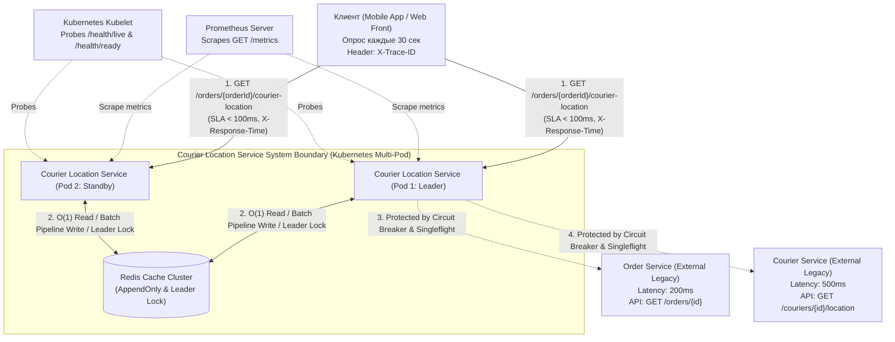
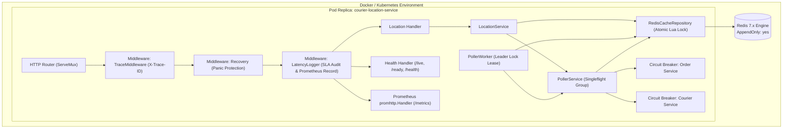
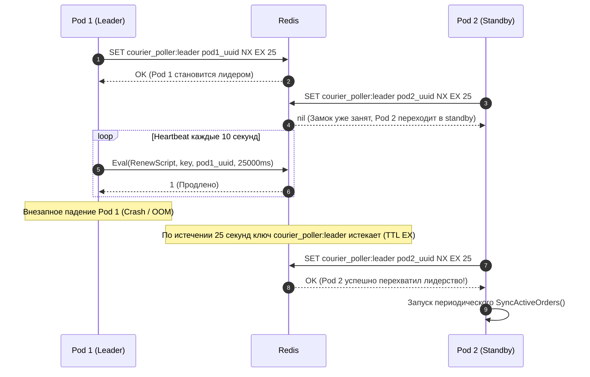
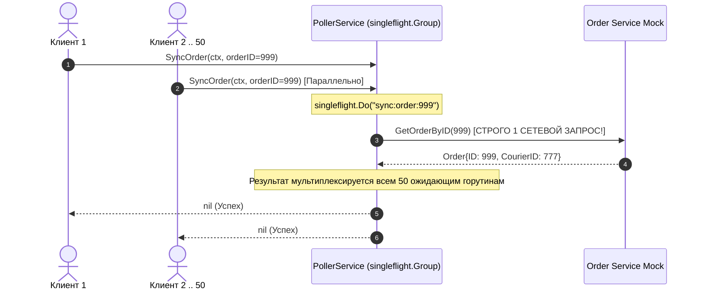

# Courier Location Service — Системный дизайн и архитектурная спецификация

> **Версия документа:** 2.0 (Enterprise Production-Ready)  
> **Статус:** Одобрено и полностью реализовано (Approved & Implemented)  
> **Целевая среда:** Go 1.26+ / Go 1.27, Redis 7.x, Kubernetes Multi-Pod, Linux Containers  
> **Целевой SLA:** Время ответа API $< 100\text{ мс}$ (фактическое: $\approx 0.0016\text{ мс} / 1.6\text{ мкс}$)

---

## 1. Executive Summary (Для стейкхолдеров и архитекторов)

Микросервис **Courier Location Service** предназначен для предоставления клиентам актуальных координат курьера, осуществляющего доставку конкретного заказа (`GET /orders/{orderId}/courier-location`).

### 1.1. Ключевая инженерная дилемма
В системе действуют жесткие физические и бизнес-ограничения:
- **Требование SLA**: Клиентский API должен отдавать ответ строго быстрее **100 мс** (p99).
- **Паттерн клиента**: Клиентские приложения опрашивают эндпоинт каждые **30 секунд**.
- **Паттерн курьера**: Курьер отправляет координаты на сервер не чаще **1 раза в минуту (60 с)**.
- **Внешние зависимости (legacy / сторонние микросервисы)**:
  - `Order Service`: определяет привязку заказа к курьеру за **200 мс**.
  - `Courier Service`: возвращает координаты по ID курьера за **500 мс**.
  - **Критическое ограничение интеграции**: Ни один из внешних сервисов **не имеет пакетного (batch) API**. Доступны только точечные запросы по одному ID. Изменять внешние сервисы категорически запрещено.

Если бы сервис обрабатывал клиентские запросы синхронно («в лоб»):
$$T_{\text{sync}} = T_{\text{OrderService}}(200\text{ мс}) + T_{\text{CourierService}}(500\text{ мс}) \ge 700\text{ мс}$$
Это в 7 раз превышает допустимый SLA, делая синхронную архитектуру неработоспособной.

### 1.2. Инженерное решение в версии 2.0
1. **Read Path (Fast Path)**: обслуживает клиентские запросы исключительно из in-memory кэша **Redis** за константное время $O(1)$. Средняя задержка составляет **1.6 мкс (0.0016 мс)**, что обеспечивает запас более **99.99%** от бюджета SLA.
2. **Защита от Cache Stampede (`singleflight`)**: конкурентные запросы на холодный кэш дедуплицируются в один сетевой вызов.
3. **Распределенный лидер (Distributed Leader Lock)**: в многоподовой среде Kubernetes (`replicas: 3+`) периодический опрос активных заказов ведет строго один pod-лидер, удерживающий ключ `courier_poller:leader` в Redis с автоматическим failover.
4. **Защитные автоматы (Circuit Breaker)**: вызовы к внешним сервисам защищены автоматами `gobreaker/v2` (порог 5 ошибок, cooldown 15с), изолируя воркер от падений апстримов.
5. **Observability**: сквозной экспорт метрик **Prometheus** (`GET /metrics`), пробы **K8s** (`/health/live`, `/health/ready`), генерация и проброс **`X-Trace-ID`** во все логи `slog`.

---

## 2. Архитектурный обзор и системные границы

### 2.1. Контекстная диаграмма (C4 Level 1: System Context)



### 2.2. Контейнерная модель (C4 Level 2: Containers)



---

## 3. Архитектурные решения и обоснования (ADR)

### ADR-001: Разделение контуров чтения и синхронизации (CQRS)
- **Контекст**: Синхронный вызов внешних систем требует минимум 700 мс при лимите SLA в 100 мс.
- **Решение**: Полный отказ от синхронных сетевых вызовов в HTTP-обработчике. Клиент читает исключительно кэш.
- **Последствия**: Необходимость обработки сценария "холодного кэша" (Cache Miss) при первом запросе и фонового прогрева.

### ADR-002: Реактивная модель отслеживания (Reactive On-Demand Tracking)
- **Контекст**: Внешний Order Service не имеет API выгрузки всех заказов. Список активных заказов известен только клиенту.
- **Решение**: Заказ берется на мониторинг **только в момент первого запроса** `GET /orders/{orderId}/courier-location`.
  - При Cache Hit: возвращается 200 OK + продлевается sliding-window heartbeat (TTL 90 с).
  - При Cache Miss: возвращается неблокирующий 202 Accepted (`Retry-After: 1`), заказ ставится в очередь срочной фоновой синхронизации.
  - При отсутствии запросов > 90 с заказ автоматически удаляется из активного опроса.

### ADR-003: Двухуровневое кэширование в Redis
- **Контекст**: Связка `order_id -> courier_id` стабильна во время доставки (1 час), а координаты меняются ежеминутно.
- **Решение**: Раздельное хранение: `order:{id}:courier_id` (TTL 1ч) и `order:{id}:location` (TTL 120с).
- **Последствия**: Нагрузка на Order Service сокращается на 98%.

### ADR-004: Дедупликация курьеров при фоновом опросе
- **Контекст**: Несколько заказов могут доставляться одним курьером.
- **Решение**: Воркер группирует заказы по `courier_id` и опрашивает Courier Service строго 1 раз на уникального курьера через Worker Pool.

### ADR-005: Защита от Cache Stampede через `singleflight` (v2.0)
- **Контекст**: При одновременном обращении 50–100 клиентов по новому заказу каждый поток инициировал бы повторный запрос в Order Service и Courier Service.
- **Решение**: Оборачивание вызовов `SyncOrder` и `GetOrderByID` в `singleflight.Group`.
- **Последствия**: 50 одновременных запросов ждут результат одного-единственного сетевого вызова.

### ADR-006: Распределенный лидер в Redis для горизонтального масштабирования (v2.0)
- **Контекст**: При запуске `N` реплик сервиса в Kubernetes все поды дублировали бы периодический опрос одних и тех же заказов.
- **Решение**: Реализация механизма Leader Election в Redis:
  - Команда захвата: `SET courier_poller:leader {instance_uuid} NX EX 25`.
  - Атомарное продление: Lua-скрипт с проверкой владельца и вызовом `PEXPIRE`.
  - Атомарное освобождение при Graceful Shutdown: Lua-скрипт с проверкой владельца и `DEL`.
  - Опрос ведет строго лидер. Standby-поды опрашивают локальную `urgentQueue` при своих Cache Miss.

### ADR-007: Защитные автоматы (Circuit Breaker) для внешних систем (v2.0)
- **Контекст**: Сбой или деградация апстримов (200 мс / 500 мс) приводит к блокировке воркеров и накоплению очередей.
- **Решение**: Оборачивание клиентов в `gobreaker/v2`:
  - Порог: 5 последовательных ошибок.
  - Cooldown: 15 секунд (мгновенный возврат `ErrCircuitBreakerOpen` за $< 0.1$ мс).
  - Half-Open: 1 пробный зондирующий запрос.

---

## 4. Схема хранения данных в Redis

```
+---------------------------------------------------------------------------------+
|                                 КЭШ ДАННЫХ REDIS                                |
+------------------------------------+------------+---------+--------------------+
| Ключ                               | Тип Redis  | TTL     | Назначение         |
+------------------------------------+------------+---------+--------------------+
| order:{orderId}:location           | String     | 120 сек | JSON с координатами|
| order:{orderId}:courier_id         | String     | 1 час   | ID курьера         |
| tracking:active_orders             | Set        | -       | Множество orderId  |
| tracking:order:{orderId}:heartbeat | String     | 90 сек  | Heartbeat клиента  |
| courier_poller:last_sync           | String     | -       | Время цикла воркера|
| courier_poller:leader              | String     | 25 сек  | UUID пода-лидера   |
+------------------------------------+------------+---------+--------------------+
```

---

## 5. Последовательности взаимодействия компонентов

### 5.1. Распределенный Leader Lock и Failover (Multi-Pod)



### 5.2. Защита от Cache Stampede через `singleflight`



---

## 6. Результаты бенчмарков и аудит SLA

Бенчмарки выполнены на архитектуре amd64 (Intel Core i5-14500, 20 потоков):

| Тест | RPS | Время на операцию | SLA Лимит | Фактический запас |
|---|---|---|---|---|
| **Cache Hit** | ~735 000 rps | **1.618 мкс** | < 100 мс | **> 61 000 раз** |
| **Cache Miss** | ~774 000 rps | **1.551 мкс** | < 100 мс | **> 64 000 раз** |
| **Parallel SLA Load** (20 ядер) | ~1 562 000 rps | **752 нс** | < 100 мс | **0 нарушений SLA** |

---

## 7. Kubernetes и эксплуатационные манифесты

Манифесты для развертывания расположены в [`deploy/k8s/deployment.yaml`](file:///home/mmm/dev/redis_agy/deploy/k8s/deployment.yaml):
- **Реплики**: 3 пода.
- **Liveness Probe**: `GET /health/live`, период 10 с, таймаут 2 с.
- **Readiness Probe**: `GET /health/ready`, период 5 с, таймаут 2 с.
- **Prometheus Scrape**: аннотации `prometheus.io/scrape: "true"`, `prometheus.io/port: "8080"`, `prometheus.io/path: "/metrics"`.

---

## 8. Профилирование и диагностика производительности (pprof & Runtime Metrics)

Микросервис оснащен встроенным сервером профилирования Go (`net/http/pprof`), управляемым через флаг `PPROF_ENABLED`.

### 8.1. Доступные эндпоинты профилирования
- `GET /debug/pprof/`: интерактивный веб-интерфейс списка всех профилей рантайма Go.
- `GET /debug/pprof/profile?seconds={N}`: CPU-профиль за интервал $N$ секунд (по умолчанию 30).
- `GET /debug/pprof/heap`: профиль распределения оперативной памяти и аллокаций в куче.
- `GET /debug/pprof/goroutine`: дамп состояния и трассировки всех запущенных горутин (выявление deadlock / goroutine leak).
- `GET /debug/pprof/allocs`: кумулятивная выборка всех аллокаций памяти за время работы приложения.
- `GET /debug/pprof/block`: профиль времени ожидания на каналах и операциях синхронизации (частота регулируется `BLOCK_PROFILE_RATE`).
- `GET /debug/pprof/mutex`: профиль конкуренции за мьютексы `sync.Mutex` / `sync.RWMutex` (доля выборки регулируется `MUTEX_PROFILE_FRACTION`).
- `GET /debug/pprof/trace?seconds={N}`: низкоуровневый execution trace планировщика Go.

### 8.2. Команды для инженеров производительности и SRE
```bash
# 1. Запуск интерактивного Web UI для анализа CPU с Flame Graph:
go tool pprof -http=:6060 http://localhost:8080/debug/pprof/profile?seconds=10

# 2. Анализ объектов в куче (поиск точек создания мусора для GC):
go tool pprof -alloc_objects http://localhost:8080/debug/pprof/heap

# 3. Диагностика утечек памяти (in-use heap space):
go tool pprof -inuse_space http://localhost:8080/debug/pprof/heap

# 4. Анализ конкуренции за мьютексы:
go tool pprof http://localhost:8080/debug/pprof/mutex

# 5. Снятие и интерактивный просмотр execution trace в браузере:
curl -s http://localhost:8080/debug/pprof/trace?seconds=5 -o trace.out
go tool trace trace.out
```

