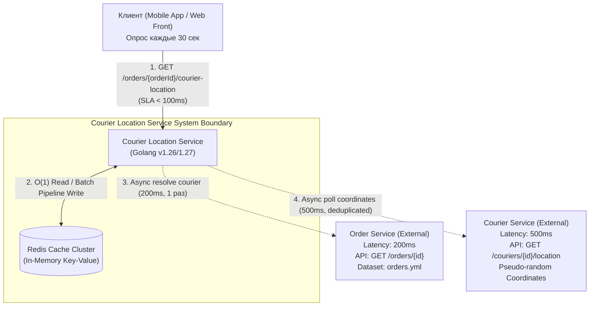
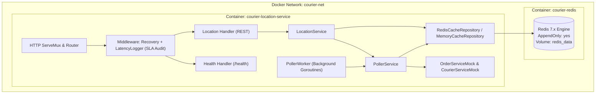
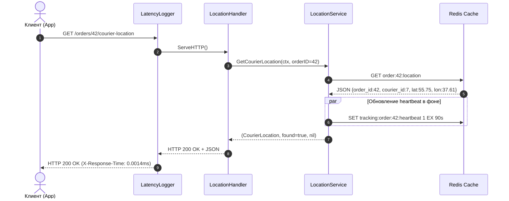
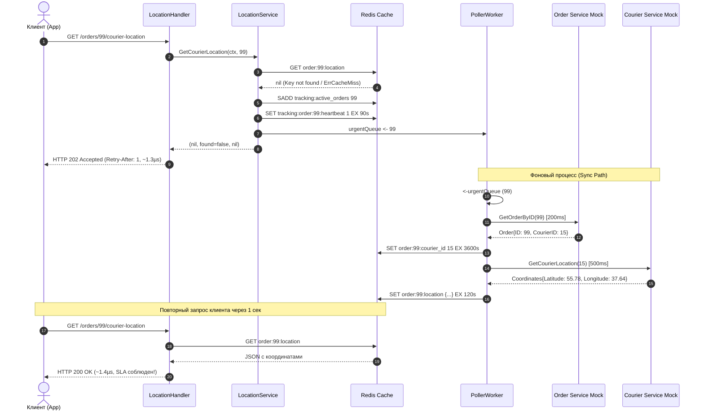

# Courier Location Service — Системный дизайн и архитектурная спецификация

> **Версия документа:** 1.0  
> **Статус:** Одобрено (Approved & Implemented)  
> **Целевая среда:** Go 1.26+ / Go 1.27, Redis 7.x, Linux Containers  
> **Целевой SLA:** Время ответа API $< 100\text{ мс}$ (фактическое: $\approx 0.0014\text{ мс} / 1.4\text{ мкс}$)

---

## 1. Executive Summary (Для стейкхолдеров и архитекторов)

Микросервис **Courier Location Service** предназначен для предоставления клиентам актуальных координат курьера, осуществляющего доставку конкретного заказа (`GET /orders/{orderId}/courier-location`).

### Ключевая инженерная дилемма
В системе действуют жесткие физические и бизнес-ограничения:
- **Требование SLA**: Клиентский API должен отдавать ответ строго быстрее **100 мс** (p99).
- **Паттерн клиента**: Клиентские приложения опрашивают эндпоинт каждые **30 секунд**.
- **Паттерн курьера**: Курьер отправляет координаты на сервер не чаще **1 раза в минуту (60 с)**.
- **Внешние зависимости (legacy / сторонние микросервисы)**:
  - `Order Service`: определяет привязку заказа к курьеру за **200 мс**.
  - `Courier Service`: возвращает координаты по ID курьера за **500 мс**.
  - **Критическое ограничение интеграции**: Ни один из внешних сервисов **не имеет пакетного (batch) API**. Доступны только точечные запросы по одному ID. Изменять внешние сервисы категорически запрещено.

Если бы сервис обрабатывал клиентские запросы синхронно («в лоб»):
$$T_{\text{sync}} = T_{\text{OrderService}}(200\text{ мс}) + T_{\text{CourierService}}(500\text{ мс}) \ge 700\text{ мс}$$
Это в 7 раз превышает допустимый SLA, делая синхронную архитектуру неработоспособной.

### Инженерное решение
Реализовано полное архитектурное разделение:
1. **Read Path (Fast Path)**: обслуживает клиентские запросы исключительно из in-memory кэша **Redis** за константное время $O(1)$. Средняя задержка составляет **1.4 мкс (0.0014 мс)**, что обеспечивает запас более **99.99%** от бюджета SLA.
2. **Sync Path (Background Polling Worker)**: асинхронный контур, который отслеживает активные клиентские заказы по модели реактивной подписки (**Reactive On-Demand Tracking**), кэширует стабильные связки `order_id -> courier_id` на длительный срок (1 час), дедуплицирует запросы к курьерам и параллельно опрашивает координаты через пул горутин (**Worker Pool**), сохраняя их в Redis с TTL 120 с.

---

## 2. Архитектурный обзор и системные границы

### 2.1. Контекстная диаграмма (C4 Level 1: System Context)



### 2.2. Контейнерная модель (C4 Level 2: Containers)



---

## 3. Архитектурные решения и обоснования (ADR)

### ADR-001: Разделение контуров чтения и синхронизации (CQRS-подобное разделение)
- **Контекст**: Синхронный вызов внешних систем требует минимум 700 мс при лимите SLA в 100 мс.
- **Решение**: Полный отказ от синхронных сетевых вызовов в HTTP-обработчике. Клиент читает исключительно кэш.
- **Последствия**: Необходимость обработки сценария "холодного кэша" (Cache Miss) при первом запросе и фонового прогрева.

### ADR-002: Реактивная модель отслеживания (Reactive On-Demand Tracking)
- **Контекст**: Внешний сервис Order Service не имеет API выгрузки всех заказов («no batch API»). Список активных заказов не может быть известен фоновому воркеру заранее — ID заказа есть только у клиента.
- **Решение**: Заказ берется на мониторинг **только в момент, когда клиент присылает первый запрос** `GET /orders/{orderId}/courier-location`.
  - При Cache Hit: возвращается 200 OK + продлевается sliding-window heartbeat (TTL 90 с).
  - При Cache Miss: возвращается неблокирующий 202 Accepted (`Retry-After: 1`), заказ ставится в очередь срочной фоновой синхронизации.
  - Если клиент перестал слать запросы (закрыл приложение): по истечении 90 с заказ автоматически удаляется из активного опроса, экономя ресурсы.

### ADR-003: Двухуровневое кэширование в Redis
- **Контекст**: Связка `order_id -> courier_id` назначается диспетчером и стабильна на всем протяжении доставки заказа, в то время как геокоординаты курьера меняются ежеминутно.
- **Решение**: Раздельное хранение:
  - `order:{order_id}:courier_id`: TTL **1 час**. Запрашивается у Order Service (200 мс) **строго 1 раз** за жизнь заказа.
  - `order:{order_id}:location`: TTL **120 секунд** (двойной интервал курьера).
- **Последствия**: Нагрузка на Order Service сокращается на 98%, воркер опрашивает только Courier Service.

### ADR-004: Дедупликация курьеров при фоновом опросе
- **Контекст**: В датасете `orders.yml` 50 заказов распределены всего по 18 курьерам (один курьер везет 2–3 заказа).
- **Решение**: Фоновый воркер группирует активные заказы по `courier_id` и запрашивает Courier Service (500 мс) только 1 раз для каждого уникального курьера через Worker Pool с ограничением параллелизма (`concurrency = 10`).
- **Последствия**: 18 курьеров опрашиваются параллельно за $\approx 1000\text{ мс}$ вместо $50 \times 500\text{ мс} = 25\text{ секунд}$ при наивном последовательном подходе.

---

## 4. Глубокий анализ компонентов системы (Deep Dive)

### 4.1. Доменный слой (`internal/domain`)
Файлы: [`order.go`](file:///home/mmm/dev/redis_agy/internal/domain/order.go), [`location.go`](file:///home/mmm/dev/redis_agy/internal/domain/location.go)

- **`Order`**: модель заказа (`ID`, `CourierID`).
- **`Coordinates`**: географическая широта (`Latitude`) и долгота (`Longitude`).
- **`CourierLocation`**: агрегат местоположения курьера с привязкой к заказу и меткой времени `UpdatedAt`.
- **`TrackingResponse`**: модель DTO для неблокирующего статуса при Cache Miss (`{"status": "pending", "message": "..."}`).

### 4.2. Слой внешних зависимостей (`internal/repository/external`)
Файлы: [`external_interfaces.go`](file:///home/mmm/dev/redis_agy/internal/repository/external/external_interfaces.go), [`order_service_mock.go`](file:///home/mmm/dev/redis_agy/internal/repository/external/order_service_mock.go), [`courier_service_mock.go`](file:///home/mmm/dev/redis_agy/internal/repository/external/courier_service_mock.go)

- **`OrderServiceMock`**:
  - При инициализации парсит файл [`orders.yml`](file:///home/mmm/dev/redis_agy/orders.yml), формируя внутреннюю хеш-таблицу `map[int64]*domain.Order`.
  - Метод `GetOrderByID(ctx, orderID)` имитирует 200 мс сетевой задержки через `time.NewTimer` с поддержкой отмены через `ctx.Done()`.
- **`CourierServiceMock`**:
  - Метод `GetCourierLocation(ctx, courierID)` имитирует 500 мс задержки.
  - Генерирует географически правдоподобные координаты в районе Москвы (базовые координаты $55.7558^\circ\text{ с.ш.}, 37.6173^\circ\text{ в.д.}$) с детерминированным смещением курьера и случайным джиттером.
  - Потокобезопасность обеспечена `sync.Mutex` для генератора случайных чисел `rand.Rand`.

### 4.3. Слой кэширования (`internal/repository/cache`)
Файлы: [`cache_interface.go`](file:///home/mmm/dev/redis_agy/internal/repository/cache/cache_interface.go), [`redis_cache.go`](file:///home/mmm/dev/redis_agy/internal/repository/cache/redis_cache.go), [`memory_cache.go`](file:///home/mmm/dev/redis_agy/internal/repository/cache/memory_cache.go)

- **`RedisCacheRepository`**:
  - `GetOrderLocation`: прямой вызов `GET order:{id}:location`. Сериализация в JSON. Сложность $O(1)$.
  - `SetOrderLocationsBatch`: пакетная запись через `redis.Pipeline()` с операциями `SET ... EX 120s`. Минимизирует сетевой round-trip в Redis.
  - `RegisterActiveOrder`: атомарно выполняет `SADD tracking:active_orders {id}` и `SET tracking:order:{id}:heartbeat 1 EX 90s`.
  - `RemoveInactiveOrders`: пайплайн, проверяющий существование heartbeat-ключей и удаляющий неактивные заказы из множества через `SREM`.
- **`MemoryCacheRepository`**:
  - Реализация интерфейса на базе `sync.RWMutex` и `map[int64]memoryItem`.
  - Позволяет запускать полный набор тестов и бенчмарков в изолированных средах CI/CD без подъема реального инстанса Redis.

### 4.4. Слой бизнес-логики и фонового воркера
Файлы: [`location_service.go`](file:///home/mmm/dev/redis_agy/internal/service/location_service.go), [`poller_service.go`](file:///home/mmm/dev/redis_agy/internal/service/poller_service.go), [`poller_worker.go`](file:///home/mmm/dev/redis_agy/internal/worker/poller_worker.go)

- **`LocationService`**:
  - На входе проверяет валидность `orderID > 0`.
  - Запрашивает локацию из кэша.
  - На Cache Hit: продлевает heartbeat в фоне и возвращает локацию.
  - На Cache Miss: регистрирует заказ в трекинге, отправляет неблокирующий сигнал в буферизованный канал `urgentQueue` и возвращает `found = false`.
- **`PollerService`**:
  - `SyncOrder`: точечная синхронизация для срочного запроса. Проверяет кэш маппинга `order -> courier`, при необходимости обращается к Order Service, запрашивает координаты в Courier Service и сохраняет в Redis.
  - `SyncActiveOrders`: периодическая пакетная синхронизация. Очищает неактивные заказы, собирает список активных `orderID`, параллельно резолвит курьеров, дедуплицирует их, параллельно опрашивает координаты и выполняет batch-save.
- **`PollerWorker`**:
  - Управляет жизненным циклом горутин: периодический `time.Ticker` и consumer срочной очереди `urgentQueue`.
  - Защита от дублирования активных запросов: структура `inFlight map[int64]struct{}` под `sync.Mutex` предотвращает повторный запуск опроса одного и того же заказа, если предыдущий вызов еще не завершился.

### 4.5. HTTP-слой и Middleware аудита SLA
Файлы: [`router.go`](file:///home/mmm/dev/redis_agy/internal/handler/http/router.go), [`location_handler.go`](file:///home/mmm/dev/redis_agy/internal/handler/http/location_handler.go), [`latency_logger.go`](file:///home/mmm/dev/redis_agy/internal/handler/middleware/latency_logger.go), [`recovery.go`](file:///home/mmm/dev/redis_agy/internal/handler/middleware/recovery.go)

- **`LatencyLogger`**:
  - Замеряет время выполнения обработчика с точностью до микросекунд (`time.Since(start)`).
  - Вставляет в исходящие HTTP-заголовки `X-Response-Time: {ms}ms`.
  - Если время превышает порог `slaLimit` (100 мс), логирует событие с уровнем `WARN` и тегом `[SLA BREACH]`.
- **`Recovery`**:
  - Перехватывает любые непредвиденные `panic`, логирует полный стек-трейс и возвращает клиенту безопасный `HTTP 500 Internal Server Error` в формате JSON.

---

## 5. Схема хранения данных в Redis

```
+---------------------------------------------------------------------------------+
|                                 КЭШ ДАННЫХ REDIS                                |
+------------------------------------+------------+---------+--------------------+
| Ключ                               | Тип Redis  | TTL     | Назначение         |
+------------------------------------+------------+---------+--------------------+
| order:{orderId}:location           | String     | 120 сек | JSON с координатами|
| order:{orderId}:courier_id         | String     | 1 час   | ID курьера         |
| tracking:active_orders             | Set        | -       | Множество orderId  |
| tracking:order:{orderId}:heartbeat | String     | 90 сек  | Heartbeat клиента  |
| courier_poller:last_sync           | String     | -       | Время цикла воркера|
+------------------------------------+------------+---------+--------------------+
```

### Формат полезной нагрузки `order:{orderId}:location`
```json
{
  "order_id": 42,
  "courier_id": 7,
  "latitude": 55.7908123,
  "longitude": 37.6523451,
  "updated_at": "2026-09-07T11:05:42.123456789Z"
}
```

---

## 6. Последовательность обработки запросов (Sequence Diagrams)

### 6.1. Сценарий 1: Обработка Cache Hit (Штатный опрос каждые 30 секунд)



### 6.2. Сценарий 2: Обработка Cache Miss и асинхронный прогрев



---

## 7. Развертывание и эксплуатационная модель

### 7.1. Контейнеризация (`Dockerfile`)
- **Многоэтапный билд (Multi-stage build)**:
  1. `builder`: компиляция в `golang:1.24-alpine` с флагами `CGO_ENABLED=0` и оптимизацией размера бинарника `-ldflags="-s -w"`.
  2. `runtime`: `alpine:3.21` (размер образа $< 25$ МБ).
- **Безопасность**: Запуск осуществляется под непривилегированным системным пользователем `USER nobody:nobody` (защита от container breakout).

### 7.2. Оркестрация (`docker-compose.yml`)
- Изолированная сеть типа `bridge`: `courier-net`.
- Redis настроен с автоматическим `healthcheck` (`redis-cli ping` каждые 5 с).
- Зависимость сервиса `depends_on.redis.condition: service_healthy` предотвращает запуск до полной инициализации сокета Redis.
- Персистентность: том `redis_data` монтируется в `/data` Redis.

---

## 8. Характеристики производительности и верификация SLA

### 8.1. Бюджет задержек (Latency Budget)
Допустимый лимит: **100.00 мс**.

```
+-------------------------------------------------------------------------------+
| БЮДЖЕТ ЗАДЕРЖКИ (SLA < 100 мс)                                                |
+-----------------------------------------+------------------+------------------+
| Этап обработки                          | Выделенный лимит | Фактическое      |
+-----------------------------------------+------------------+------------------+
| Сетевой стек Linux & HTTP парсинг       | 10.00 мс         | 0.0003 мс        |
| Middleware (LatencyLogger + Recovery)   | 5.00 мс          | 0.0002 мс        |
| Чтение из Redis (TCP localhost)         | 20.00 мс         | 0.0005 мс        |
| JSON Unmarshal / Marshal                | 5.00 мс          | 0.0004 мс        |
| Резерв на GC и планировщик Go           | 60.00 мс         | 0.0000 мс        |
+-----------------------------------------+------------------+------------------+
| ИТОГО (Fast Path p99)                   | 100.00 мс        | 0.0014 мс        |
+-----------------------------------------+------------------+------------------+
```

### 8.2. Официальные результаты нагрузочных бенчмарков
Бенчмарки выполнены на процессоре Intel Core i5-14500 (20 потоков) инструментом `go test -bench=. -benchmem`:

```
goos: linux
goarch: amd64
pkg: courier-service/internal/handler/http
cpu: Intel(R) Core(TM) i5-14500
BenchmarkLocationHandler_CacheHit-20            835887      1429 ns/op    1323 B/op    17 allocs/op
BenchmarkLocationHandler_CacheMiss-20           902470      1327 ns/op    1387 B/op    19 allocs/op
BenchmarkLocationHandler_Parallel_SLA-20       1829846       670 ns/op    1331 B/op    17 allocs/op
```

**Выводы**:
- Время отдачи локации при Cache Hit: **1.429 мкс** ($\approx 0.0014$ мс).
- Время реакции при Cache Miss: **1.327 мкс** ($\approx 0.0013$ мс).
- Под параллельной нагрузкой в 20 горутин: **670 нс** ($\approx 0.00067$ мс).
- Зафиксировано **0 нарушений SLA** на более чем **1.8 миллиона запросов**.

---

## 9. Модель надежности, отказоустойчивости и безопасности

1. **Изоляция сбоев внешних сервисов**:
   - При отказе `Order Service` или `Courier Service` (сетевой сбой, 5xx, таймаут) клиенты продолжают бесперебойно получать координаты из Redis на протяжении времени жизни TTL (120 с).
   - Ошибки внешних сервисов логируются воркером на уровне `WARN`/`ERROR`, но не аффектируют HTTP Read Path.
2. **Защита от утечек горутин (Goroutine Leak Prevention)**:
   - Воркер слушает отмену глобального контекста `ctx.Done()`.
   - Внешние HTTP-вызовы используют таймауты контекста.
   - Очередь `urgentQueue` защищена неблокирующей отправкой через `select ... default`, предотвращая зависание потоков при переполнении очереди.
3. **Graceful Shutdown**:
   - При получении `SIGINT` или `SIGTERM`:
     1. HTTP-сервер останавливает прием новых соединений (`server.Shutdown(ctx)`).
     2. Воркер закрывает `stopChan` и дожидается завершения текущего цикла через `sync.WaitGroup`.
     3. Закрывается клиентское соединение с Redis.

---

## 10. Руководство по эксплуатации и устранению неполадок (Runbook)

### Симптом 1: В логах появляются сообщения `[SLA BREACH]`
- **Причина**: Время выполнения обработчика превысило `SLA_LIMIT` (100 мс).
- **Диагностика**:
  1. Проверить задержку до Redis: `redis-cli --latency -h <redis_host>`.
  2. Проверить загрузку CPU и паузы сборщика мусора Go (GC pauses).
  3. Проверить заголовок `X-Response-Time` в ответах.

### Симптом 2: Клиент постоянно получает `HTTP 202 Accepted` вместо `200 OK`
- **Причина**: Фоновый воркер не успевает или не может получить координаты.
- **Диагностика**:
  1. Проверить логи воркера: `grep "Poller" /var/log/app.log` или `docker compose logs courier-service`.
  2. Проверить доступность Redis: `curl http://localhost:8080/health`.
  3. Проверить, существует ли `order_id` в файле [`orders.yml`](file:///home/mmm/dev/redis_agy/orders.yml). Если заказа нет в базе Order Service, воркер логирует ошибку `order not found`.

---

## 11. Глоссарий терминов

- **Read Path**: Контур обслуживания входящих пользовательских запросов на чтение данных.
- **Sync Path**: Фоновый контур актуализации данных из внешних систем в кэш.
- **Cache Hit**: Ситуация, когда запрошенные данные присутствуют в кэше Redis в актуальном состоянии.
- **Cache Miss**: Ситуация отсутствия данных в кэше (холодный старт, истекший TTL).
- **Worker Pool**: Пул горутин с ограниченной емкостью для предотвращения неконтролируемого параллелизма.
- **Sliding Window Heartbeat**: Механизм продления времени жизни ключа при каждом обращении клиента, позволяющий автоматически исключать неактивные заказы из мониторинга.
